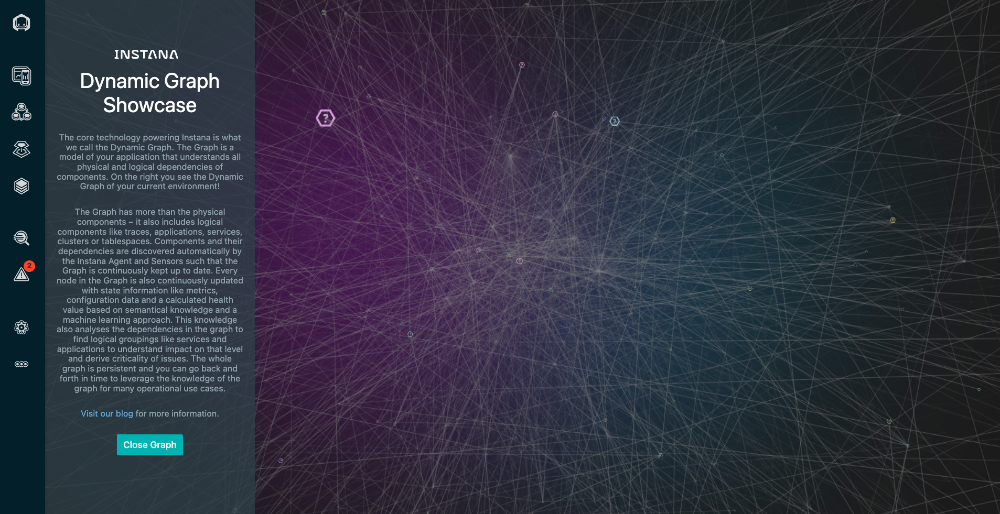
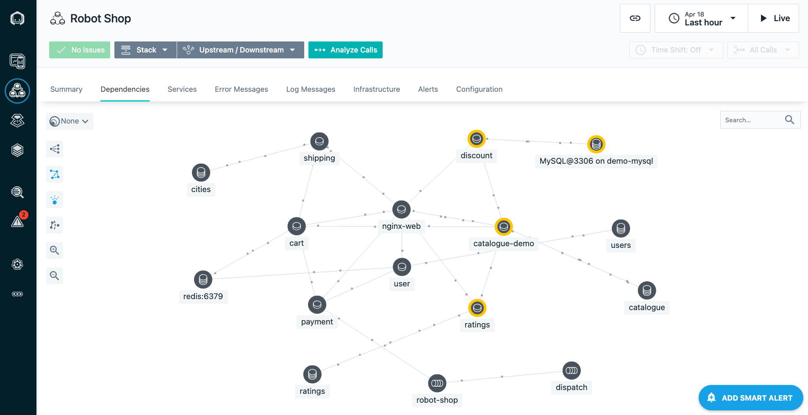
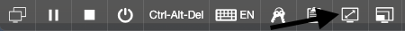
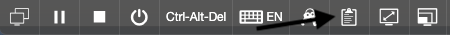
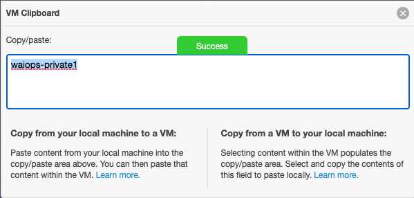

--- 
title: Think Lab 1189 - Observability of a Hybrid Application Using Instana
description: Observability of a hybrid application using Instana
---

## Introduction

This lab will allow students to learn how to intrument a hybrid application for observability using Instana.  The application consists 
of a cloud native component running in kubernetes (OpenShift) and a traditional server with IBM MQ and IBM App Connect Enterprise.  
Once instrumented, students will explore the rich set of monitoring data available to monitor the traditional and cloud native infratructure,
the application, and the web traffic.  Students will see how Instana can help them get to root cause quickly and in an intuitive way by
allowing the Instana UI to guide them through the diagnosis.  Students will also learn how to customize the environment and define custom Events.

1) In the first portion of the lab, students will instrument kubernetes and IBM ACE and MQ for monitoring.

2) Once instrumented, students will explore key aspects of the Instana user interface.   Part 1 must be completed before proceeding to the second
portion of the lab.

3) In the 3rd section of the lab, students will perform a diagnostic scenario in the hybrid application

4) Finally, in the 4th section students will learn how to perform administrative tasks.

After completing the Login section, use the other links to go directly to one of the lab exercises.

When you first login to the Soleil virtual machines, a chrome browser will be open with multiple tabs.  The first tab will be this lab guide.  We recommend that you use
the lab guide within the virtual machine so that you can easily copy and past text into the terminal windows.

## Logging into the Environment

  Before beginning the exercises, take the following steps to login to the soleil environment and access the lab environment.

  After opening your browser and logging into the lab, you'll see an image of a two computers.  The first is named thinkdemo. This 
  server is the kubernetes(OpenShift) cluster where the cloud native portion of the application will run.

  

  If the background is green, it means the virtual machine is running.  If it is not running, click the start arrow to start the VM
  

  The 2nd VM is named "MQ and ACE".  This VM is a traditional server running IBM MQ and IBM App Connect Enterprise.
  
  After the VM is running, click the picture of the **"thinkdemo"** computer to launch the desktop.  Login to the virtual machine as the 
  user **"demo"** and password **"Passw0rd"**. 

  For more information on using the soleil environment, scroll towards the bottom of the page.

## Begin the Exercises

You are now ready to start performing the lab exercises.  You must complete the Installation section first.  After that, the sections can be done in any order.  For a new user of Instana, we recommend 
performing the **Explore Instana** section of the lab next.  If you are already familiar with Instana, you can select any other section of the lab.

Select **"Installation"** in the upper left corner or select the **"Installing and Configuring Monitoring"** tile below.

<Row>

<Column colLg={4} colMd={4} noGutterMdLeft>
<ArticleCard
    color="dark"
    subTitle="Installing and Configuring Monitoring"
    title="Install the Instana Monitoring Agent and Configure the Sensors"
    href="/tutorials/Install"
    actionIcon="arrowRight"
    >

</ArticleCard>

</Column>

<Column colLg={4} colMd={4} noGutterMdLeft>
<ArticleCard
    color="dark"
    subTitle="Explorer Instana"
    title="Explore the Instana UI and Capabilities"
    href="/tutorials/Explore"
    actionIcon="arrowRight"
    >

</ArticleCard>
</Column>

<Column colLg={4} colMd={4} noGutterMdLeft>
<ArticleCard
    color="dark"
    subTitle="Diagnose a Problem"
    title="Learn How Instana Can Help you Quickly Diagnose a Complex Problem"
    href="/tutorials/Diagnose"
    actionIcon="arrowRight"
    >

</ArticleCard>
</Column>

<Column colLg={4} colMd={4} noGutterMdLeft>
<ArticleCard
    color="dark"
    subTitle="Administer Instana"
    title="Learn How to Perform Administrative Tasks in Instana"
    href="/tutorials/Administration"
    actionIcon="arrowRight"
    >

</ArticleCard>
</Column>
</Row>

***

## Using the soleil environment

  There are a couple of things that are important to know when using the soleil environment.  At the top of the screen you will see a menu bar.  You'll notice a full screen icon as shown below. You'll have a much better experience with the lab if you use full screen.

  

  Another icon on the taskbar that is important is the clipboard icon

  

  The only way to paste content into the virtual machine is by using this icon.

  To copy text into the virtual machine, perform a copy as you normally would do on your laptop/desktop.  Then, click the clipboard icon. You will notice that there is text within the clipboard user interface

  

  This will make the text available within the virtual machine. Then, within the virtual machine, either type "Ctrl-V" or right-click and use your browser to paste the text into the virtual machine.

  To copy text from the virtual machine, do the process in reverse.  Copy the text inside the virtual machine.  Then, click the clipboard icon and you will notice that the text is visible on the screen.

  

  Whatever text you see on the VM clipboard, you'll be able to past within your laptop/desktop.

  Note:  The clipboard is a little bit unreliable.  You may need to attempt to copy/paste a couple of timess.  Also, try to avoid clicking in multiple places on the screen. Copy the content (Ctrl-C), click on the clipboard, then immediately paste to either your laptop or into the virtual machine.
