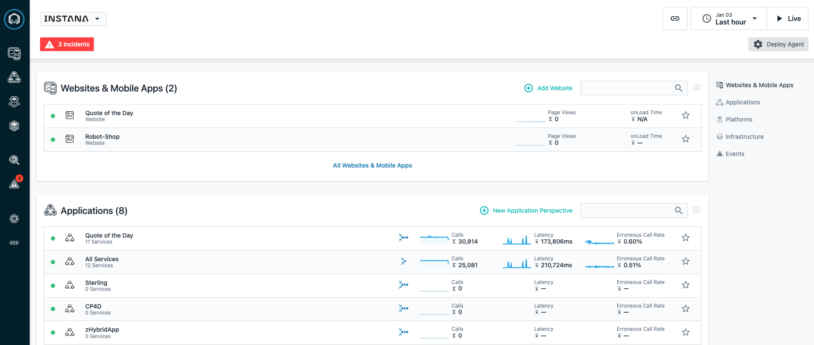

--- 
title: Hybrid Cloud Tech Academy Instana Lab 
description: Education on Using Instana in a Power Systems environment
---

## Introduction

This lab is intended to educate on how to use Instana to monitor a Power Systems environment.   The lab will focus on a few key areas including the installation and configuration of Agents, learning administrative capabilities, and how to diagnose problems with Instan.  Key sections of the lab include: 

1) In the first portion of the lab, students will instrument kubernetes and an AIX LPAR

2) Next, students will explore the monitoring capabilities of Instana in relation to Power Systems

3) In the 3rd section of the lab, students will perform a diagnostic scenario in the hybrid application

4) Finally, in the 4th section students will learn how to perform administrative tasks.

After completing the Login section, use the other links to go directly to one of the lab exercises.

## Logging into the Environment

  For the lab, you will be using the following Instana environment.  Open your browser and login to https://instana-labs.instana.io/

  Students will be logging in with user account apmdemo-2@yahoo.com.   The password will be provided separately to the students at the time of the lab.

  As part of the lab, you will be using the AIX LPAR and OpenShift Cluster where you previously setup the Wordpress application and MariaDB.  

  After successfully logging into the Instana environment, you should see the main landing page that includes a list of Websites & Mobile Applications, Applications, Platforms, Infrastructure, and Events.

  

## Begin the Exercises

You are now ready to start performing the lab exercises.  You must complete the Installation section first.  After that, the sections can be done in any order.  For a new user of Instana, we recommend performing the **Explore Instana** section of the lab next. 

Select **"Installation"** in the upper left corner or select the **"Installing and Configuring Monitoring"** tile below.

<Row>

<Column colLg={4} colMd={4} noGutterMdLeft>
<ArticleCard
    color="dark"
    subTitle="Installing and Configuring Monitoring"
    title="Install the Instana Monitoring Agent and Configure the Sensors"
    href="/tutorials/Install"
    actionIcon="arrowRight"
    >

</ArticleCard>

</Column>

<Column colLg={4} colMd={4} noGutterMdLeft>
<ArticleCard
    color="dark"
    subTitle="Explorer Instana"
    title="Explore the Instana UI and Capabilities"
    href="/tutorials/Explore"
    actionIcon="arrowRight"
    >

</ArticleCard>
</Column>

<Column colLg={4} colMd={4} noGutterMdLeft>
<ArticleCard
    color="dark"
    subTitle="Diagnose a Problem"
    title="Learn How Instana Can Help you Quickly Diagnose a Complex Problem"
    href="/tutorials/Diagnose"
    actionIcon="arrowRight"
    >

</ArticleCard>
</Column>

<Column colLg={4} colMd={4} noGutterMdLeft>
<ArticleCard
    color="dark"
    subTitle="Administer Instana"
    title="Learn How to Perform Administrative Tasks in Instana"
    href="/tutorials/Administration"
    actionIcon="arrowRight"
    >

</ArticleCard>
</Column>
</Row>

***

