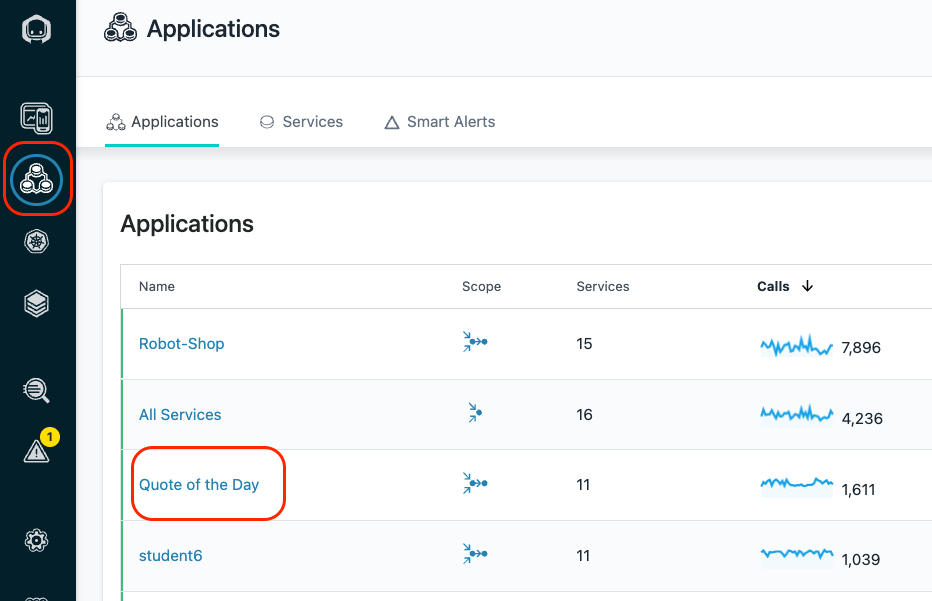
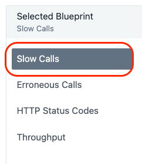
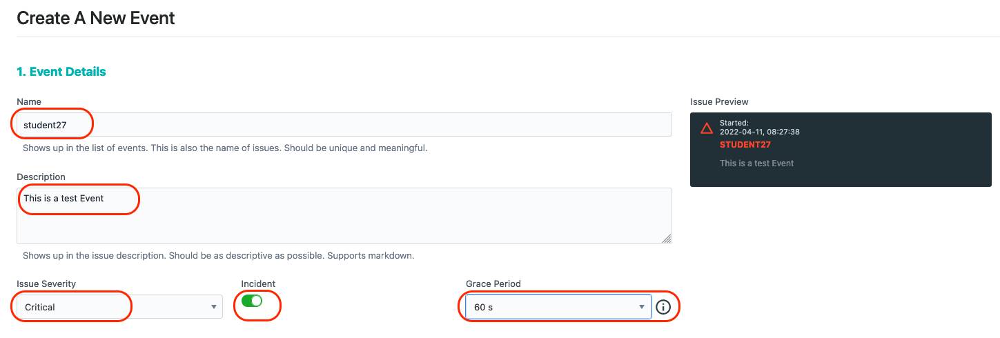

<AnchorLinks>
  <AnchorLink>4-1: Create an Analytics Based Smart Alert</AnchorLink>
  <AnchorLink>4-2: Create a Static Threshold (Event)</AnchorLink>
  <AnchorLink>4-3: Setup an Alert for the New Event</AnchorLink>
  <AnchorLink>4-4: Using Instana REST APIs</AnchorLink>
  <AnchorLink>4-5: Defining an Application Perspective</AnchorLink>
  <AnchorLink>4-6: Summary</AnchorLink>
</AnchorLinks>

# 4-1:  Create an Analytics Based Smart Alert

In this section, students are going to create an analytics based **"Smart Alert"** to detect abnormal behavior within an application.

If you haven't already done so, open a the chrome browser to the Instana tab and make sure you are logged in. 

Click on Applications.  Then, select the **"Quote of the Day"** application. 

Note: You can't use the application that you just installed for Analytics based thresholds because
there isn't enough historical data.  You could create a SmartAlert, but some functionality would not be available.  That's why we are using the **Quote of the Day** application.



Click on **"Add Smart Alert"** in the lower right corner.


There is a simple and an advanced mode.  We'll be using the advanced mode which allows you to see all of the capabilities.

In the upper right corner of the dialog, select **"Switch to Advanced Mode"**


In the upper left corner, you'll see that there are 4 different types of **Smart Alerts**
- Slow Calls
- Erroneous Calls
- HTTP Status Codes
- Throughput

Leave the default of **"Slow Calls"**


Scroll down.  You'll see that there are number of options to determine how you want to define the SmartAlert.   These options include:
- Setting up a **Static** or **Adaptive** SmartAlerts. 
- You can analyze the calls for this **application** or you can analyze specific **services** or **endpoints**.
- You can analyze **Inbound Calls** or **All Calls**
- You can include or exclude **Internal Calls**
- You can include or exclude **Synthetic Calls**


In your spare time, you can explore various capabilities.   For the lab, let's choose an **Adaptive** SmartAlert on **Slow Calls**, choose **per Service for this Application Perspective**, and analyze **All Calls** as seen below.


This will cause Instana to leverage baselines that are established so that you can detect abnormal behavior.   Each service will be evaluated independently.

Scroll down further and you'll see an option to **add filter**.   This would allow you to add a filter to analyze and alert on a subset of the services and calls.  For this lab, we won't be adding a filter and will be analyzing all **services**.

Below that, you'll see an option to specify a percentile for latency.   Specify a percentile of **95%**.   

Below the percentile, you'll see that there is a slider that allows you to adjust the **sensitivity**.  In order to see the effects of the **percentile** and **sensitivity**, you must first select a specific service where you can preview the results of your settings.  

In the **Preview for Service** dropdown, select the **qotd-rating** service.  Then, adjust the sensitivity slider.


As you adjust either the **percentile** or the **sensitivity**, you'll notice that fewer or more **red triangles** will appear on the screen.  The **red triangles** indicate when an alert would have triggered within the past 24 hours.  You can also preview the last 7 days of data, if desired.

Typically, you don't want to set your sensitivity too high because you will receive too many alerts and end users will start to ignore the alerts.  Or, if you see an obvious spike in latency that wouldn't trigger an alert, you might want to increase the sensitivity.  Of course, you may also adjust the sensitivity based on the criticality of the application.  It might be okay to receive a lot of alerts if the application is critical to the business.

Scroll down further.


You'll see that there are options for persistence over time.  This ensures that the conditions trigger for a reasonable length of time before an alert is raised.  You can adjust both the granularity of the data being evaluated and the number of consecutive metric violations before an Alert is generated.

There is also an option to select an **"Alert Channel"**.  An **"Alert Channel"** is a way to notify people about the event via different channels such as e-mail, slack, Watson AIOPs, etc.

Select the **"Select Alert Channels"** option.  A dialog will open with a few different **Alert Channels**.  Select the **IT Operations** Alert Channel.  This channel will send email to the **IT Operations** team.

Click on the **"Create Alert Channel"** link in the upper right corner.

Click on the dropdown list for the **"Alert Channel type"**.


You will see a list of all of the **"Channel"** options.  You can setup Alert Channels to slack, e-mail, Watson AIOps, splunk, and more.  There is also a **"Generic Webhook"** option that allows you
to integrate with a variety of 3rd party products that support webhooks.


For the lab, we won't be creating a new channel.  We just wanted you to see the options.    

At the bottom of the screen click the **Cancel** button.


Back on the list of alert channels, click the **Add 1 Channel** button to add the **IT Operations** Alert Channel to your SmartAlert.


Below the Alert Channels, you'll see that you can specify **Alert Properties**.  This allows you to customize the **Alert** message content, severity, and whether or not the Alert will trigger an **Incident**.  Below you can see an example of customized **Alert Properties**


The option to trigger an **Incident** is important.  Sometimes, you just want to receive raw Events/Alerts when problems occur.  Other times, you want the **Events/Alerts** to be correlated into an **Incident**.  This option allows you to choose where the Alert shows up on the **Event** view.


Finally, at the very bottom of the screen, you will see an option to create a **Custom Payload**.  This option allows you to customize the Event content that is forwarded to the specified Alert Channels.  Feel free to explore **Custom Payloads** on your own.


Don't bother saving your changes.  We just wanted to allow you to see your options for setting up **"Smart Alerts"** and **"Alert Channels"**

Click **"Cancel"** at the bottom of the screen until the **"Smart Alert"** dialog closes.

***

# 4-2:  Create a Static Threshold (Event)
Now, let's examine how a more traditional threshold is created and used in conjunction with Alert Channels.

On the left side of the screen, select the **"Settings"** gear.


The Settings menu provides access to most of the administrative tasks within Instana.  You'll notice menus for Events, Alerts, Alert Channels, API Tokens, Users, Groups, Log Managemnet Integration, and more

Select **"Events"**

Once you click on **"Events"**, you will see a list of 300+ Events that are defined as out of the box thresholds within Instana.  If you want to filter the list, you can do that in a number of ways
via the drop down lists at the top of the page.


One thing you might notice is a **warning** at the top of the screen.  This indicates that traditional static alerts for application traces and services are being deprecated.  They have been replaced by **Smart Alerts**.  You'll examine Smart Alerts in the next section. Traditional **Events** are still used for infrastructure performance KPIs.

Notice that you can filter based on the Event type, severity, entity type, state, or simply enter a keyword filter.

Let's select **"Entity Type"**

Select the **"Entity Type"** dropdown list and type **"IBM MQ"** into the field.  You'll notice that a few different options show up. Each of the options is an Entity Type.  You can filter 
on the Events related to the IBM MQ Queue Manager, Queue, Channel, etc.

Select **"IBM MQ Queue Manager"** from the dropdown list.


This will filter the Events to the list of Events that are written against the IBM MQ Queue Manager entity type.  There are several out of the box threshold Events that will detect things like
channel initiator status, queue manager status, publish/subscribe engine status, and more.

Let's create a new Event.

At the top of the screen, select the **"+ New Event"** link.


Fill in the following information for you new Event:
- Give your Event a name.  Use your **your name** when creating the Event as seen below.
- Enter a **description** for the Event.  For example, **"Test Event"**.
- Select a **severity** (Warning or critical)
- Select the option of whether you want your Event to get correlated into Incidents
- Select a **Grace Period**.   


The Grace Period is a capability that allows you to avoid getting multiple alerts during flapping.  Let's say you are monitoring for high CPU utilization on a server.  If CPU utilization goes High, 
then Low, then High over a short period of time, you typically only want to see **one** event.  By setting a "Grace Period" of something like 60 seconds, you would only receive 1 Event during that interval.

Now, scroll down a little further and fill in the remaining options.

In the **"Condition"** section, select the dropdown and choose **"Built-in Metrics"**.  Most of your thresholds will be written against these **Built-in Metrics**.  


The choice of **Custom metrics** would only apply to custom metrics that are being fed into Instana.  The **System Rules** are a specialized set of rules for doing thing like detecting that an entity or Host is **"offline"**.

Once you select **"Built-in Metrics"** another dropdown list will appear.  The new dropdown list is asking for the **"Entity type"** that you are going to write your threshold against.

In the **"Entity type"** dropdown, select **"Host"**.  Notice that you can type in letters such as **"ho"** to filter the list.   As you type the letters, it will immediately start to filter the content.


To the right of the **Entity type**, select the **Time window** dropdown.  This is the duration that you want to monitor the data while performing the evaluation.   Host metrics are collected at 1 second granularity.  This allows you to monitor the data for 30 seconds and use Min, Max, Avg, and Sum when doing the evaluation.  

After specifying an **"Entity type"**, a new dropdown appears with a list of available **"Metrics"**.  Select the **"Metric"** dropdown and choose **CPU > Used**.


After making your select, some new dropdowns appear on the screen looking for the following information:
- Aggregation:  Since Instana is capture data at a high interval, you can use Min, Max, Avg, Sum as part of your evaluation.  
- Operator: What type of evaluation do you want to do (>, < =, etc.)
- Percentage - This field is actually different depending on the metric you are evaluating. In this case, you are evaluating a metric that is a percentage.

In the dropdowns, choose **"30 s"** for the time window, **"avg"** for the Aggregation, **">"** for the Operator, and **"90"** for the Percentage.


This threshold will utilize 30 data points collected at each second and calculate an average.  If the average is greater then 90%, then the threshold will trigger.

Now you have to select the **"Scope"** that this threshold will apply to. The scope identifies which available entities should be evaluated.

Select the dropdown list.


In the dropdown list, you'll see the following options:
- You have the option of applying this threshold to an **"Application Perspective"**. This would limit the scope of the threshold to a specific application.
- You can use a **"Dynamic Focus Query"** to filter to a specific list of entities.
- Or, you can have your threshold apply to **"All Available Entities"**.

Let's make this a global Event and choose the **"All Available Entities"** option.

Click the **"Create"** button to save your new Event.

***

# 4-3:  Setup an Alert for the New Event
Now that you have a new Event defined, you need to define and Alert.  Alerts are used to notify people and teams via various Alert Channels.  You previously
reviewed the options for Alert Channels.  The Alerts will be sent to one or more Alert Channels that you select.

Select **"Settings"** on the left side navigation.  Then select **"Alerts"** 


Click on the **"+ New Alert"** link 


Give the new **"Alert"** a name.  To ensure you can find your **"Alert"**, call it **"your name"**

Select the dropdown labeled **"Alert on Event(s)"**


You will see that there are multiple options.  You can setup an Alert for a particular Entity Type.  For example, you might setup an Alert for all Oracle Database Events.

In your case, select **"Alert on Event(s)"**.  This option allows you to select a specific list of Events to forward to an Alert Channel(s).

Further down on the page, select the **"Add Events"** link.


Initially, you will see a list of ALL Events.

Let's filter the list to just a specific **Entity Type**.   Select the **"Entity Type"** dropdown list and select **"Host"**


You will now see a filtered list of Events related to Host sensor.   Find the Event with **"your name"** and select the checkbox.   Then, select the **"Add 1 Event"** button at the bottom.


You will now see the 1 selected Event listed.  Further down on the screen you will see a **"Scope"** section.  This determines which Entities this Alert will apply to.


Select the **"Apply on"** dropdown list. You'll see that you can choose one of 3 options:
- Application Perspective:  This option allows you to limit the scope of the alert to a specific application.
- Selected Entities Only:  You use the dynamic focus queries to filter to a specific set of Entities
- All Available Entities:  The Alert would apply to any Entity that triggered the Event threshold.

Select the **"Selected Entities Only"** option


A new widget will appear on the right side of the screen asking you to specify the **"Dynamic Focus Query"**

In the entry field, enter the lucene query that will filter to the AIX LPAR that you setup for this lab.  Enter the following value:
```sh
entity.host.name:<your hostname>
```


These lucene queries can be complex sequences of AND and OR statements.  In this case, we are looking for 1 specific queue.

Next, click on the **"+ Add Alert Channels"** link


A dialog will open with a list of available **"Alert Channels"**.  Since this is Host Event, let's notify the IT Operations team. Select the **IT Operations** Alert Channel.

Then, click the **"Add 1 Channel"** button.


Scroll down to the bottom. You will see an optional section where you can add custom payloads by adding Key/Value pairs.  We're going to skip that section.

Finally, click the **"Create"** button to save your Alert.


Now, any time that the Event that you created triggers against your Hostname, the IT Operations team will be notified via Email.

That completes this section of the lab.

***

# 4-5:  Using Instana REST APIs
Instana has a Robust set of REST APIs that can be used to query data and to administer the Instana server.  In this section, we'll show you how to do a simple REST query.

The first step is to get an API token that you can use.  In this lab we won't be creating an API token, but it is possible to create API tokens with different permissions.  An API token already exists that has read-only permissions.  We'll be using that token.

In the UI, select **settings** on the left side and then select **API Tokens**.

Find the API token named **Read-Only** and select the **eye** icon next to the API token to expose the API token string.  


Then, click on the copy icon to copy the API token.


The documentation for the Instana REST APIs can be found here:   https://instana.github.io/openapi/

On the left side, you will see a list of API categories.  you can select the **down arrows** to expend each category to see the individual API calls.  


Once you select a specific API, you'll see the swagger documetation including samples.


Here is a sample API request that will retrieve the list of application perspectives that are defined in Instana.  Note that the **?pretty** at the end is optional, but makes the formatting of the results much nicer.

```sh
curl -k --silent -X GET -H "authorization: apiToken \<API token copied from UI\>"  "https://instana-labs.instana.io/api/application-monitoring/applications?pretty"
```

Replace \<API token copied from UI\> with the API token that you copied earlier.  Run this command from a terminal window that has the curl command installed.

The result will look something like this:


You'll see one stanza for each application perspective.

***

# 4-5:  Defining an Application Perspective
In this section, we're not going to create an **Application Perspective**, but we are going to examine how you might define one.   The process for creating an **Application Perspective** is very simple.  What's important is identifying the components that make up the application.

Select **Applications** on the left side navigation.


Next, select the **Quote of the Day** application.

Within the **Quote of the Day** application, select the **Configuration** tab.


You'll see the details of what defines the **Application Perspective**


Section 2 is the most important section. This is where you specify the components that should be included for this application.  It is a combination of **AND** and **OR** statements as well as **brackets ()**.  In this example, we specify the **qotd** namespace where this application is running.  For a kubernetes based application, this is the easist way to define an application.  Simply specify the namespace(s) where it is running. In addition, this application has some services that are running outside of kubernetes.  We typically either specify the **service names** or we specify the **endpoint names** that make up the application.  In this example, we specified the **service names**. 

You'll notice that in some cases we provided the exact name of the service (**vader-acemq.coc-ibm.com-BK1:EG2**) which is our IBM ACE server.  In other cases, we used **contains** to find substrings like **QM1** which is our IBM MQ Queue Manager name.

Finally, the last parameter filters **out** any **endpoint (URL)** that is **GET /health**.   **Get /health** represents that kubernetes health checks.  These aren't part of the business application transactions and should not be included.

Sections 3 and 4 provide other options.  Sometimes you don't want to monitor downstream services or only want to monitor immediate downstream services.  Sometimes you only want to monitor inbound calls.  You get to choose and the resulting monitored transactions will be slightly different.   
-

***

# 4-6:  Summary

At this point, you have created an Event and an Alert for that Event.  The next time the custom **"Event"** that you created triggers, an **"Alert"** will be sent to the **"IT Operations"** Alert Channel.  In this case, an Email will be sent to the IT Operations team. 

In this section of the lab, you learned how to create a **Smart Alert**, a **traditional Alert (Event)**, and learned this **Alerts** are routed to the correct people/teams via **Alert Channels**.   You have also learned how to use some of the simpler Instana **REST APIs**.  Finally, you learned out **Application Perspectives** are defined within Instana.


If you haven't completed all of the sections, you can continue other portions of the lab. Select one of the lab exercises in the upper left corner or select one of the images below.


<Row>

<Column colLg={4} colMd={4} noGutterMdLeft>
<ArticleCard
    color="dark"
    subTitle="Explorer Instana"
    title="Explore the Instana UI and Capabilities"
    href="/tutorials/Explore"
    actionIcon="arrowRight"
    >


</ArticleCard>
</Column>

<Column colLg={4} colMd={4} noGutterMdLeft>
<ArticleCard
    color="dark"
    subTitle="Diagnose a Problem"
    title="Learn How Instana Can Help you Quickly Diagnose a Complex Problem"
    href="/tutorials/Diagnose"
    actionIcon="arrowRight"
    >


</ArticleCard>
</Column>

</Row>


***
