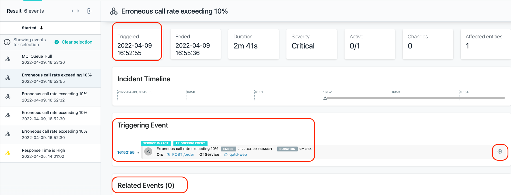

<AnchorLinks>
  <AnchorLink>3-1: Evaluate the Events via an Incident</AnchorLink>
  <AnchorLink>3-2: Analyze the Calls</AnchorLink>
  <AnchorLink>3-3: Confirm Your Diagnosis</AnchorLink>
  <AnchorLink>3-4: Summary</AnchorLink>
</AnchorLinks>

In this section of the lab, you will learn how Instana can help you get to root cause of a problem in a quick and intuitive manner.

## 3-1: Evaluate the Events via an Incident

On the left side, select **"Events"**

This will open up a panel showing all of the Incidents that are affecting the monitored systems and applications. Incidents are the raw Events that have been correlated via
Analytics into an Incident. 

Make sure that the time selection in the upper right corner is set to **"Last hour"**

As seen in the previous picture, select the Incident that is triggering on the **"QOTD High Erroneous Call Rate"** request on entity **vader-acemq.coc-ibm.com-BK1:EG2**.  It indicates that there are large numbers of erroneous/failed requests.

You will see the details related to raw **Events** that were correlated via **analytics** into an **Incident**.

In this case, you should see the **Triggering Event** and a few **Related Events**.   The **Triggering Event** is the first event that starts to impact a service or a website.  The **Related Events** are events that Instana determined are related by leveraging analytics including the relationships that exist between the various entities, services, and endpoints.

Within the Incident, you can see when the Incident opened and in some cases, when it closed.  And, you can see the **Incident Timeline**.  This is the time when each event opened and closed.   If the event is still open, it will be color coded with the event severity.

On the right side, click on the **"+"** symbol to expand the Triggering Event.

You can see in the historical graph that there are periods of time where erroneous (failed) calls are high.

## 3-2: Analyze the Calls

Next, click the **"Analyze Calls"** button to analyze the calls.

You will be taken to an analytics screen where you can see all of the failed calls for **"gen.supplychain"**.  gen.supplychain is the ACE flow. You can also see latency for the calls is high and you can see a number of calls are failing.

Select one of the failing **"gen.supplychain"** calls

You will be taken to a screen where you can see the Call Stack and Stack Trace data. You explored this previously, but you did it with a good transaction.  Now you are 
examining a failed transaction.

Scroll to the bottom of the page where you see the **"Calls"**.  This shows you the timeline of the calls for this single transaction.   

You'll notice that there are plus signs.  Click on the plus signs to expand the call stack.

When you see errors, normally you go to the bottom of the call stack.  That's because the error in the last call is likely affecting the upstream calls.  

Click on the last call and examine the information on the right side.  Do this by clicking on the text **PUT CP4I.DEMO**

In your spare time, you can click on other types of transactions in the Call Stack, but for now, let's focus on the diagnostic scenario.

When you select the MQ call, the right side of the screen gets updated with context for that call.  You will see the following error message:  **"IBM MQ call failed with compcode '2' ('MQCC_FAILED') reason '2053' ('MQRC_Q_FULL')"**

This error message indicates that the MQ Queue is full and new messages can't be put on the queue.  

At this point, we believe we have a diagnosis for our problem.  The MQ Queue is full and the transactions are failing because they can't post a message to the queue.

## 3-3: Confirm Your Diagnosis

In many cases, you can confirm the root cause of the problem by analyzing the **call stack** and **stack trace**, but sometimes you need to investigate further.  

In this case, you may want to examine the queue that is causing this error. Or, you may want to confirm whether the problem has been resolved.

Instana automatically puts a link to the queue in the lower right corner.  For other technologies, there are similar links.

Scroll all the way to the bottom on the right side of the screen.  You'll see that there is a link that will link to the MQ Queue named **CP4I.DEMO.API.Q**.  This is the queue that
is being used for this application transaction.

Click on the link to navigate to the queue details.

On this screen, you'll notice a few important things.
- In the upper right corner, you'll notice that the time range is specifically set to the timeframe when the Incident was open.
- The queue depth reached 100%
- The **Messages In** rate is zero during the timeframe that the queue is full.

Clearly there is a problem with this queue.  The queue is full and transactions won't work properly because new messages can't be placed on the queue.  We need to resolve the queue depth problem in order to fix the application.

From here, if you wanted to investigate further, you could use the **bread crumbs** at the top of the screen or the **Stack** to navigate to the related resources.  For example, examine the Host metrics or the OpenShift infrastructure.

That completes this section of the lab.

## 3-4: Summary
In this portion of the lab, you learned out to diagnose a problem in Instana.  Ultimately, determining that the queue was full and preventing transactions from completing.

To continue other portions of the lab, select one of the lab exercises in the upper left corner or select one of the images below.

<Row>

<Column colLg={4} colMd={4} noGutterMdLeft>
<ArticleCard
    color="dark"
    subTitle="Explorer Instana"
    title="Explore the Instana UI and Capabilities"
    href="/tutorials/Explore"
    actionIcon="arrowRight"
    >

</ArticleCard>
</Column>

<Column colLg={4} colMd={4} noGutterMdLeft>
<ArticleCard
    color="dark"
    subTitle="Administer Instana"
    title="Learn How to Perform Administrative Tasks in Instana"
    href="/tutorials/Administration"
    actionIcon="arrowRight"
    >

</ArticleCard>
</Column>
</Row>