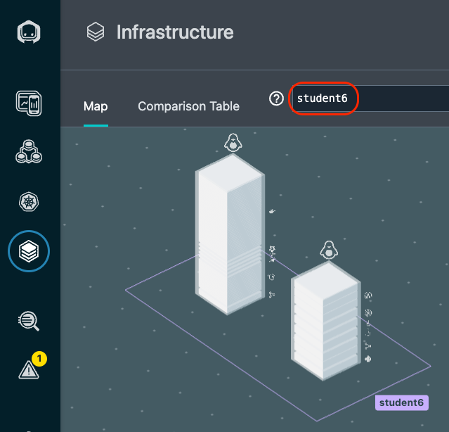
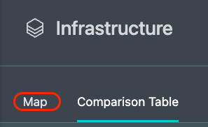
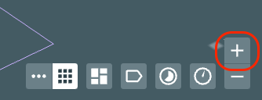
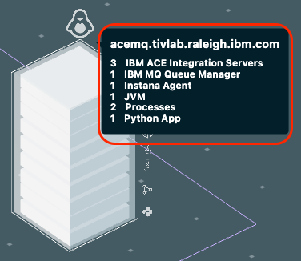
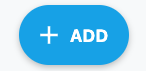
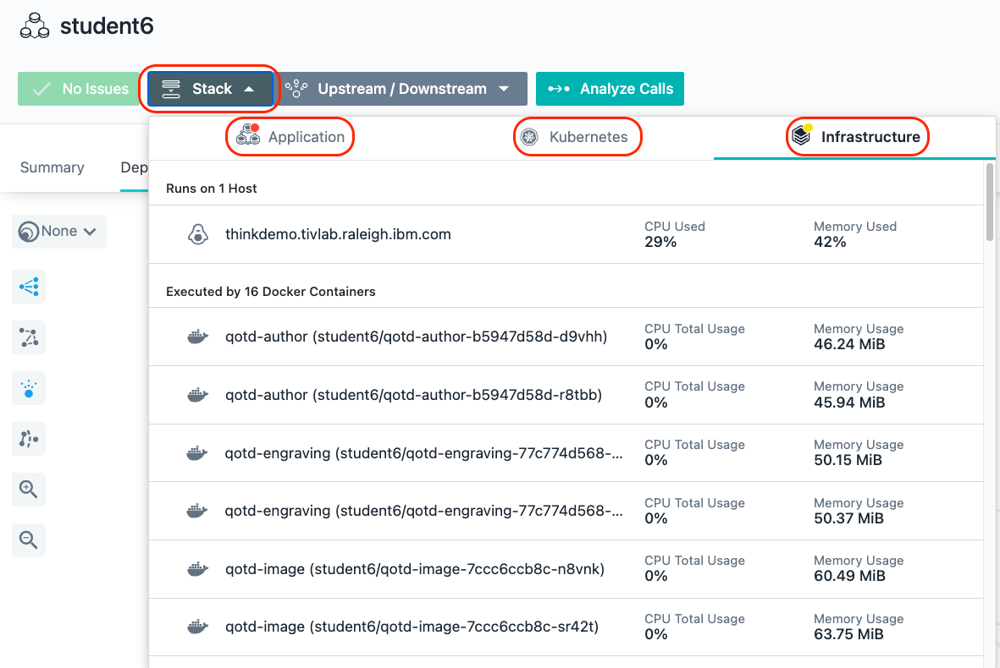
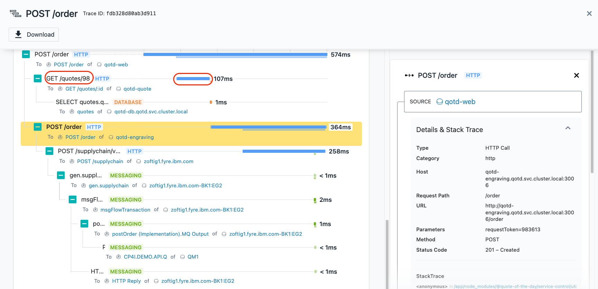
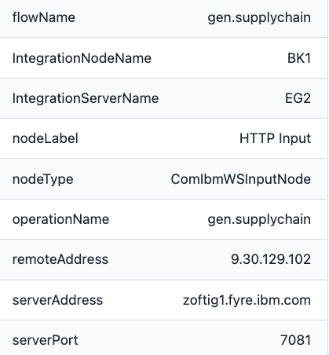

<AnchorLinks>
  <AnchorLink>2-1: Explore kubernetes</AnchorLink>
  <AnchorLink>2-1: Explore the Infrasture View</AnchorLink>
  <AnchorLink>2-3: Create an Application Perspective</AnchorLink>
  <AnchorLink>2-4: Exploring the Application</AnchorLink>
  <AnchorLink>2-5: Summary</AnchorLink>
</AnchorLinks>

***

In this portion of the lab, you will explore some key Instana capabilities including monitoring of kubernetes, monitoring of applications, and monitoring of infrastructure.

## 2-1: Explore Kubernetes

In this section of the lab, you want to be logged into the thinkdemo virtual machine.  If you are currently logged into the MQ/ACE virtual machine, switch to the other VM.

Open the browser tab for the Instana user interface.

On the left navigation, select "kubernetes"
  

You will see a list of kubernetes clusters.   Look for the Cluster with your student name.  If you don't see your student name, you may need to wait a couple of minutes.
  

If you don't see your student name after a couple of minutes, we need to troubleshoot the Instana Agent.  From a terminal window, issue the following command:
```sh
oc get pods -n instana-agent
```

Check to make sure that all pods are running.

If all pods are running, we need examine the logs of one of the pods.

Type:  
```sh
oc logs POD_NAME -c instana-agent -n instana-agent
```
where **POD_NAME** is one of the pods listed in the previous command.

Assuming that your cluster name shows up properly, click on the link for your student name.

You should see a screen similar to the one below where you can see overall utilization of the kubernetes cluster.
  

Select some of the other tabs to explore the kubernetes monitoring.  We recommend you look at the Events, Nodes, and Pods tabs.  When you select the pods tab, you will see a list of all pods running within the cluster.

In the upper right corner, add your student name into the search widget.  You'll notice that it will filter the list to the pods related to the Quote of the Day application.
  

Click on one of the links on the left side and drill into the pod utilization details.


***

## 2-2: Explore the Infrastructure View

Next, explore the Infrastructure view.  To do this, click on the **"Infrastructure"** icon on the left side.
  

Look for your student name.  You'll notice that there is a square surrounding two **"towers"** with your student name.  The square is a **"zone"**.  If you recall, you 
specified a zone name when you performed the yaml based install of the Instana Agent.  The towers contained within the square represents the OpenShift worker node and the 
virtual machine running ACE and MQ. 

If this was a more typically kubernetes environment, you would see more cubes, one for each worker node.  Notice the k8s-bstern2 zone.  This is a cluster with three worker nodes.

If you are unable to find your zone due to the large number of students, you can type your student name in the filter bar at the top
   

Or, you can use the lucene query language in the search bar.
- Flyover the filter bar and select **"Entity"**
- A list will popup. Find and select **"Host"**
- Once you have select "Host", another list will popup. Select "name"
- Now, you will see **"entity.host.name:"**.  After the ":", you can do a wildcard search.  For example **"entity.host.name:student*"**.

Once you have found your zone, flyover the tower that represents your worker node.  The taller tower is the worker node.  It is taller because there are more discovered entities 
running on that server.
   

You'll notice that a number of components were automatically discovered and are instrumented for monitoring.

Next, flyover the other tower.  
   

This is the ACE and MQ server. You can see the MQ and ACE components along with a discovered JVM, a python app, and more.

In the bottom right corner there are several icons that allow you to organize the Infrastructure view in different ways.  For example, group the servers by OS architecture.
  

We recommend you explore those at the end of the lab if time permits.

Next, click on the **"Comparison Table"** near the top of the page.
  

This table shows a sortable and searchable list of the Hosts that make up this environment.  You can quickly find hosts consuming high CPU, high memory, or have poor health.

In addition, if you select where is says **"Hosts"**, there is a dropdown list that allows you to see lists of JVMs, containers, etc.
  

Change from **"Hosts"** to **"Docker Containers"** in the dropdown list and you'll see a complete list of containers and their utilization and health.

Switch back to the Map view by clicking on **"Map"** near the upper left corner.
  

Zoom in with the plus sign in the bottom right corner.
  

You'll notice that each tower is actually comprised of multiple pizza boxes.   Each one represents an **"Entity"** such as an MQ Queue Manager or an ACE Integration Node.
  

Flyover the ACE/MQ server again until you see a list of all discovered Entities.  If you only see 1 entity, move your mouse to one of the corners of the tower.
Once you see all of the entities, click your mouse.  You'll see a dialog open 
  

Use the scroll bar to scroll down. You'll notice that you see each of the types of Entities that were discovered.  Expand the MQ entity type and you'll see the Queue
Manager that was discovered.
  

It is possible to click on either the "Open Dashboard" button or the links for the individual entities.  If you clicked, you could navigate to either the Host 
operating system metrics or the specific middleware entity.

Click on the "Open Dashboard" button and we'll examine the Host Agent dashboard.  After you click on the button you'll see a screen that looks like this:
  

You can see fine grained metric data for the Host operating system. Scroll down and explore the other metrics.

As you scroll down the page, you'll notice a section on the left side of the screen that contains a list of Entity types that were discovered. This is the same list that you 
saw earlier on the Infrastructure view.
  

Expand the IBM MQ Queue Manager section and select the link for the **QM1@acemq.tivlab.raleigh.ibm.com** queue manager

You will navigate to the dashboard for the MQ Queue Manager. Scroll down the page and examine the metrics.  There are many tables that contain links that would allow you to
drill into the listener, topics, queues, channels, and more.  Let's focus on the Channels.  Scroll down to the table labeled **"Channels"**.  You will notice two channels with the
same name. One represents loopback and the other represents the server IP Address.   Select the link next to the one with connection name 10.0.0.3.
  

Examine the Channel metrics on the page.

Next, look at the top of the screen.  You'll notice that this is a breadcrumb that allows you to navigate back to where you were earlier in your nativations.   It is also
possible to use the back button in your browser.
  

If time permits at the end of the lab, you can explore some of the other elements within the MQ sensor or other middleware such as ACE.


### 2-3: Create an Application Perspective
**Application Perspectives** allow you to group together a number of different services and endpoints into dashboard that shows the health and performance of a business application.
In this section, you will create and **Application Persective** for the **Quote of the Day** application that you setup earlier.


On the left hand navigation, select **"Applications"**. You will see a screen open up that contains a list of all applications that are defined in the environment.  Initially, this
this will be small until the students in the class define their applications.  
  

The next thing you are going to do is define an application.  You will see an **"Add"** button in the bottom right corner. 
  

Click on the **"Add"** button

A dialog will open with two options.  We'll examine the "Global Smart Alerts" in the Administrative section of this lab.  For now, click on the **"New Application Perspective"** button
  

When the dialog opens, click the **"Next"** button
  

On the next screen, click the radio button for **"All downstream services"**.  This will ensure that all of the downstream calls for the application will be monitored in this 
Application Perspective.

Next, click the **"Add filter"** button.

You will see list of filter options.  Select the option labeled **"Zone"**.
  


Then, click on the **"value"** field that is next to the **"Zone"**.  You should see a list of Zones including your student name.  Select your student name or type the name 
in the entry box.
  


Now, click the **"Add filter"** button and select **"AND"**
  


Select **"Add filter"** again.  Then, in the search field type the word **"endpoint"**.  After typing the word **"endpoint"**, you will see an entry "Endpoint Name".  

Select **"Endpoint Name"**
  


A dropdown list will appear.  If it doesn't, click on the **"Value"** field.  In the dropdown list, find and then select the entry for **"GET /health"**.
  


Finally, select the **"="** symbol in between **Endpoint Name** and **GET /health** and select **"!= (does not equal)"** from the drop down list.
  


This last filter is going to filter out the **"GET /health"** requests which are just kubernetes health checks and are unrelated to the application transactions.

You screen should now look like this:
  


Click **"Next"** to go to the next screen.
  


On the next page, give the name of your Application Perspect your student name.  For example, **"student6"**.  Then, click the **"All Calls"** radio button to monitor all calls.  Then, click the **"Create"** button to create your Application Perspective.
  

You have now created an Application Perspective. In the next section, you'll explore the application.


### 2-4: Explore the Application

After creating the application, your screen should have automatically changed context to show the **studentXXX** Application Perspective that you just defined.

Initially, you probably won't see any metrics on the screen.  In the upper right corner, click the **"Live"** button and within a short amount of time you should start
to see metrics in the widgets.
  

On this page you can see the transaction volumes, the number of erroneous calls, latency, and the top services that make up the application.

You'll notice a number of tabs across the top of the screen.  Explore these tabs.  In particular, let's take a look at the **"Depedencies"** tab.

On the dependencies tab, you'll see a full topology of the application services.  This topology is discovered automatically.  You can see transactions flowing between
the different nodes in the topology.   Most of these services are node.js based cloud-native services. The **"acemq.tivlab.raleigh.ibm.com-BK1:EG2"** is the ACE 
integration node named BK1 and Integration Server named EG2.   The QM1 node in the topology is the MQ Queue Manager named **"QM1"**.

Click on the **"QM1"** node.  Notice that there are 3 options that would allow you to navigate to the MQ dashboard, the transaction Flow within MQ, or analyze the transaction
calls through MQ.

Click on **"Upstream/Downsteam"** near the top of the page.  This will allow you to see a list of Upstream and Downstream services for the application.
  


Click on **"Stack"** where you can view the Application, Kubernetes, and Infrastructure stack that makes up the application.
  


All of this contextual and relationship data helps you analyze and debug you applications to get to root cause as quickly as possible.  In addition, our built 
analytics uses this data to automatically group multiple related **"Events"** into a single **"Incident"** for diagnosis.

Close the **Stack** dialog by either clicking on the **Stack** button or somewhere else on the background of the Instana GUI.

Click on the Services Tab
  


You will see a list of services that make up the application.

Scroll down on the page until you see the **"qotd-engraving"** service.

Click on the **qotd-engraving** link on the left Column.  The qotd-engraving service is the service that calls an ACE flow and then puts a message on the MQ queue. 
We want to explore this service in more detail.
  


Click on the **"Analyze Calls"** button to analyze the individual transactions that are executing within the **"qotd-engraving"** service.
  

This will take you to a screen showing all of the different types of calls taking place within the qotd-engraving service.  At the top, there is a summary of all calls in terms of
transaction rates, return codes, erroneous calls, and latency.

On the right side, click the arrow to expand the list of qotd-engraving **"POST /order"** calls.  Instana is capturing 100% of the transactions so that you don't miss intermittent problems that might be occurring in the environment.  
  


Select one of the requests

You are now looking at the tracing data for a single transaction.  At the top of the screen, you will see a summary of the latency, sub-calls and timeline. On the right
side of the screen, you'll see the details and stack trace.
  


Scroll down and you will see the service endpoint list
  


Finally, scroll to the bottom of the screen and you will see a detailed call stack.  The call stack gives you the timing and sequence of the call going through the application.
  


If you select the text on the left or the timeline bar, the **"Details & Stack Trace"** context will change.

Explore the different types of calls going through this transaction by selecting the individual call.  When you select an entry, examine the detailed information on the right.
  


You should notice that different request types are color coded differently.  Blue represents the HTTP requests going through an App Server or java process. Orange represents
a database call.  And green represents a messaging call (ACE and MQ).  

When you select the Node.js App Server requests, you'll see the **StackTrace** on the right hand side. Within the **StackTrace**, click one of the URLs.
  


When you click on the link, Instana will decompile the code and show you the lines of code.  The exact line of code that is executing will be highlighted in yellow.
  


When you select the ACE portions of the call Stack (gen.supplychain, msgFlowTransaction, and postOrder) you will see key information including the flow name, Integration Node,
Integration Server, IP address, and more.

  


When you select the MQ portion of the call stack, you'll see key information related to the MQ environment on the right.  The information includes the Queue Manager, Queue Name,
and the message ID that was posted on the queue.
  


Scroll down to the very bottom where you see a link named **"CP4I.DEMO.API.Q"**. 

Click on the **"CP4I.DEMO.API.Q"** link and you will navigate to the Queue page of the MQ sensor for the CP4I.DEMO.API.Q queue.

Earlier, you explored the Queue Manager and the MQ Channels.  You're now looking at the queue that is being used by this application.  You'll notice key information
like the oldest message on the queue, queue depth, input/output rates, and more.
  


That completes this section of the lab.

***

## 2-5: Summary

In this exercise you have explored some of the key capabilities within Instana.  You explored kubernetes monitoring. You explored the Infrastructure view.  You defined an 
Application Perspective. And you explored the application monitoring details.


To continue other portions of the lab, select one of the lab exercises in the upper left corner or select one of the images below.


<Row>

<Column colLg={4} colMd={4} noGutterMdLeft>
<ArticleCard
    color="dark"
    subTitle="Diagnose a Problem"
    title="Learn How Instana Can Help you Quickly Diagnose a Complex Problem"
    href="/tutorials/Diagnose"
    actionIcon="arrowRight"
    >


</ArticleCard>
</Column>

<Column colLg={4} colMd={4} noGutterMdLeft>
<ArticleCard
    color="dark"
    subTitle="Administer Instana"
    title="Learn How to Perform Administrative Tasks in Instana"
    href="/tutorials/Administration"
    actionIcon="arrowRight"
    >


</ArticleCard>
</Column>
</Row>