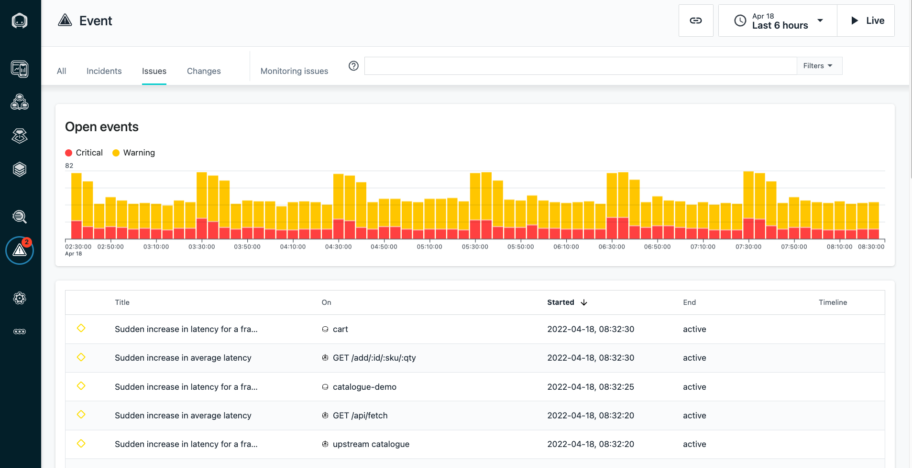

<AnchorLinks>
  <AnchorLink>2-1: Explore PowerVM Monitoring</AnchorLink>
  <AnchorLink>2-2: Explore OpenShift on Power</AnchorLink>
  <AnchorLink>2-3: Explore the Quote of the Day Application</AnchorLink>
  <AnchorLink>2-4: Unbounded Analytics</AnchorLink>
  <AnchorLink>2-5: Logs</AnchorLink> 
  <AnchorLink>2-6: Summary</AnchorLink>
</AnchorLinks>

***

In this portion of the lab, you will explore some key Instana capabilities including monitoring of PowerVM, kubernetes, monitoring of applications, and monitoring of infrastructure.

If you haven't already done so, login to the Instana user interface via a browser.  Use the following URL:  https://instana-labs.instana.io/
Login as apmdemo-2@yahoo.com and the password provided by your instructor and located in the **Box Note**.

## 2-1: Explore PowerVM Monitoring
In this section of the lab, we'll explore how Instana can be used to monitor the PowerVM infrastructure.  This includes monitoring AIX LPARs, Linux LPARs, IBM i LPARs and the Power infrastructure via the HMC.

Select **Infrastructure** on the left size of the Instana UI.
  

In the Infrastructure view, you will notice that there are several key Power resources.  You'll see a Zone named **IBM i** that contains an IBM i LPAR that is running DB2.  You will also see a zone named **pLinux** that contains a Linux LPAR running on Power.  You should also see the nodes that makeup your OCP Cluster and your AIX LPAR with the Zone names that you specified during the installation.

Explore the Host Agents on IBM i, AIX, and Linux on Power by selecting the Node and then selecting the **Open Dashboard** button.  When you select the Node, be careful to select the top corner to ensure that you are selecting Host Agent rather than one of the other sensors.  When you select the Node, a dialog will appear in the left side of the screen and you can select **Open Dashboard**.
  

When exploring the **AIX** LPAR, try to find your own LPAR.   You can do this by looking for the **Zone** name that you specified during the configuration.  If you can't find it, you can specify a filter at the top of the screen using the **lucene** query language.  You can specify a string similar to the one shown below:  entity.zone:<your zone\>
  

Once you find your AIX LPAR, you can explore both the Host metrics and the MariaDB metrics.

You will notice that **AIX** and **Linux on Power** are nearly identical to **Linux on x86**.  The configuration details on the left side are slightly different, but most Host metrics are the same.  When you look at the **IBM i Host Agent**, you'll notice quite a few differences.  This Host Agent is more extensive and includes information such as running **jobs**, **auxiliary storage pools**, **spinning disks**, **queues** and more.

Next, explore the monitoring data being gathered via the HMC sensor.  On the left size of the navigation, select **Platform** and then select **IBM Power**
  

You will see a list of HMC's that are being monitored.  In this environment, there is only one HMC.  You can see a summary of what the HMC is managing.  In this case, 3 physical systems and 46 partitions.   Notice that there is also a 2nd tab where you can navigate directly to the **Systems** that are being managed by the HMC.
  

Select the blue link to drill into the HMC.

You will now see a list of the 3 systems that are being managed by this HMC and a summary of the systems.
  

Click on the blue link for the last server.  This system is the most interesting because it has the most LPARs.

You should now see a detailed page showing the configuration and performance of this Power server.  Explore the metrics on the page.  Notice that there are multiple tabs at the top of the screen.  Explore the **Logical Partition** and **Virtual I/O Server** tabs.  
  

On the Logical Partition screen, you will initially see a list of LPARs.  Select one of the LPARs and drill into the details.  Notice that there are multiple tabs at the of the screen for **Summary**, **Network**, and **Storage**.  You'll see that key LPAR information such as the entitled processor information and whether the LPAR is capped or uncapped is captured.

Navigate back to the physical server and select the **Virtual I/O Server** tab.  You'll see a list of VIOS LPARs.  Select one of the VIOS LPARs and drill into the details.
  

The **Virtual I/O Server** is one of the most important things to examine.  If the Virtual I/O Server is low on I/O resources, it can impact the performance of the LPARs that use the VIOS.  Drill into one of the Virtual I/O Servers and examine the data on the **Network** and **Storage** tabs.  You'll see key information including the **Shared Ethernet Adapters**, **SR-IOV**, **Fibre Channel Adapters**, **Shared Storage Pools**, and more.
  

***

## 2-2: Explore OpenShift on Power

In this section of the lab, we'll focus on monitoring of the OpenShift infrastructure when the OCP is running on Power.  What's important to understand is that there are no Power specific metrics.  The only thing you will notice that is different between x86, Power, and Z is on the Details tab of the Nodes.  On that screen, you can see the platform details.
  

On the left navigation, select **Platforms** and then **Kubernetes**
  

You will see a list of kubernetes clusters.   Look for the Cluster with your name.  If you don't see your name, you may need to wait a couple of minutes.
  

Click on the link labeled **power-k8s (cluster)**

You should see a screen similar to the one below where you can see overall utilization of the kubernetes cluster.
  

Select some of the other tabs to explore the kubernetes monitoring.  We recommend you look at the Events, Nodes, and Pods tabs.  When you select the pods tab, you will see a list of all pods running within the cluster.

Click on one of the links on the left side and drill into the pod utilization details.
  

***

### 2-3: Explore the Quote of the Day Application

Navigate to the **Applications** portion of Instana where we'll examine some of the key application related information that is gathered.
  

In the upper right corner, set the time interval so that you are viewing the **Last hour** of data.

Select the **Quote of the Day** application
  

On this page you can see the **Golden Signals**.  This includes the transaction volumes, the number of erroneous calls, latency, as well as the top services that make up the application.

You'll notice that there is a period of time where you can see an increase in the number of **Erroneous Calls**.  At the same time interval, there is an increase in **Latency**.  Later, we'll investigate these conditions in a diagnostic scenario.

You'll notice a number of tabs across the top of the screen.  Explore these tabs.  In particular, let's take a look at the **"Depedencies"** tab.
  

On the dependencies tab, you'll see a full topology of the application services.  This topology is discovered automatically.  You can see transactions flowing between
the different nodes in the topology.   Most of these services are node.js based cloud-native services. The **"acemq.tivlab.raleigh.ibm.com-BK1:EG2"** is the ACE 
integration node named BK1 and Integration Server named EG2.   The QM1 node in the topology is the MQ Queue Manager named **"QM1"**.  **apim-demo-gw-gateway-cp4i-apic.apps.jarjar.coc-ibm.com** is a DataPower API Gateway. 

From an application perspective, **qotd-web** calls the **qotd-engraving** service which in turn makes an API call to the DataPower API Gateway.  The **API Gateway** makes an API call to an **ACE flow** which then calls **MQ** and puts a message on a queue.

Flyover a few of services. You'll notice that you can see a summary of the latency and erroneous calls for each service.
   

Click on the **"QM1"** node.  Notice that there are 3 options that would allow you to navigate to the MQ dashboard, the transaction Flow within MQ, or analyze the transaction
calls through MQ.

Click on the **Error Messages** tab and you'll see any error that has occurred within the **Last hour** of data that you are showing on the screen.
   

Click on **"Upstream/Downsteam"** near the top of the page.  This will allow you to see a list of Upstream and Downstream services for the application.
  

Click on **"Stack"** where you can view the Application, Kubernetes, and Infrastructure stack that makes up the application.
  

All of this contextual and relationship data helps you analyze and debug you applications to get to root cause as quickly as possible.  In addition, our built 
analytics uses this data to automatically group multiple related **"Events"** into a single **"Incident"** for diagnosis.

Close the **Stack** dialog by either clicking on the **Stack** button or somewhere else on the background of the Instana GUI.

Note:  It is also possible to click on the **Analyze Calls** button on the page in order to analyze individual transactions that are flowing through the application.  We'll skip that step for now and will Analyze calls as part of a diagnostic scenario later in the lab.
  

***

## 2-4: Unbounded Analytics
Instana stores data data in datastores like Cassandra, Elasticsearch, and Clickhouse in such a way that it easy to apply **unbounded analytics** to the data and search for key patterns and characteristics.   Let's explore how you can use **unbounded analytics**

On the left side, select **Analytics**
  

At the top of the screen, you'll see that there is a dropdown called **Applications -> Calls**.  If you select the dropdown, you'll notice that there are several options available to analyze Application **Calls**, **Traces**, **Websites**, **Mobile Apps**, **Infrastructure** metrics, and **Profiles**.  For this lab, we'll focus on the default selection of **Application Calls**.  In your spare time, feel free to Analyze other types of data.
  

By default, you will see a list of **all** application calls.   **Unbounded analytics** provides and opportunity to answer some questions that you might have able the application calls.   Let's look at a scenario that a DBA might be interested in.   A DBA might want to see which SQL queries are taking the longest to run.  This is easy to achieve with **unbounded analytics**.

First, we need to filter the queries to just the database calls.  For this exercise, we'll select all database calls, but we could easily filter further to specific types of databases or specific applications.  On the left side of the screen, select **Types** and then select the **Database** checkbox.  This will filter the calls to just the **Database** calls.
   

Next, click on the **Add group** button near the top of the page.
   

A drop down list will open with a list of the types of calls.  In the seach bar, type **"statement"** and then select **Database -> Statement**.
   

This will group all of the statements to the unique SQL statements that have been executed within the last hour.  By default, these are sorted based on the number of calls.

Finally, let's sort these statements based on **latency**.

On the middle right of the screen, select **Calls (sum)** and then choose **Latency (mean)** from the dropdown list.
  

You can now see a list of the unique SQL statements sorted by the mean latency for that particular SQL statement.
  

If desired, you can expand one of the arrow on the right side to see the individual SQL calls so that you can see whether all calls are slow or whether there are outliers.

And, you can select an individual call and Analyze the transaction in the context of the end-to-end application transaction.

***

## 2-5: Logs
In this portion of the lab, we'll be examining Instana's capabilities around **Log** monitoring.

Instana captures log data in a couple of ways.  It captures logs from application servers/runtimes in the context of application traces that are being captured by the app server/runtime sensors.  In addition, Instana can capture the container logs in a kubernetes/OpenShift cluster.

Log data can be seen in a number of places.  You'll see log data in context with application traces.  You'll see log data in context with kubernetes environments, and you'll see log data via **unbounded analytics**

Let's begin by looking at logs via **unbounded analytics**.   On the left side, select **analytics**
   

At the top of the screen, select the dropdown list and select **Logs**
   

The default view will show you all log entries collected within the environment.  Just like any unbounded analytics page, you can easily **filter** or **group** the log entries.  Let's try a couple of examples.

First, select the **filter** button and select **Logs Level** and then select or type **ERROR** to filter the results to only the **ERROR** log messages.
  

Next, group the log entries by the unique log messages.   Do this by selecting **Add group** and then selecting **Logs Message**.  This will create groups of unique log messages as seen below.  You can expand one of the groups by selecing the down arrow.
  

Expand the down arrow for the group of low entries with message **""responseText": "Problem requesting engraving. Internal Server Error","** . If you can't fine that entry, select another group to expand.
  

Next, select one of the log entrys and expand the **down arrow**
  

You'll see a lot of additional contextual information related to the log entry.  We don't simply show you the log message.  We show you details of where the log entry came from.  Depending on the log entry origin, this can include information like:
- Log Level (Severity)
- Kubernetes Cluster, Node, Namespace, deployment, and pod
- Host where the log originated
- Kubernetes container
- CPU and Memory utilization of the container
- Application(s) that are used by this component
- Process name
- Endpoint (URL)
- Trace ID
This additional context provides a wealth of information that is useful in diagnosing a problem.  Try clicking on a few different log entries.  You'll notice that the additional contextual details are slightly different.

In addition, you can navigate to additional details by selecting any of the **blue** links.
  

Next, let's see **Log** data in context with **kubernetes**

On the left navigation, select **Platform** and then **Kubernetes**
  

Select the **vader-qotd2** Kubernetes Cluster

As you scroll down the page, you'll see a historical graph showing the log entries for the cluster.  There is also an option to **Analyze** the logs
  

Next select **Nodes** and then select one of the nodes.
  

Scroll down and you can see the log entries for the **Node**.  The same **Analyze** icon is available if you want to drill into the individual log entries.
  

Similarly, you can view the log entries for Namespaces, Daemonsets, pods, services, and more.  Simply drill into that category of Kubernetes data and you'll see the historical graph showing the log entries.

***

## 2-6: Summary

In this exercise you have explored some of the key capabilities within Instana.  You explored PowerVM monitoring. You explored kubernetes monitoring. You explored the application monitoring details.  And, you explored how you can use unbounded analytics to glean insights.  Finally, you explored Log monitoring within Instana.

To continue other portions of the lab, select one of the lab exercises in the upper left corner or select one of the images below.

***

<Row>

<Column colLg={4} colMd={4} noGutterMdLeft>
<ArticleCard
    color="dark"
    subTitle="Diagnose a Problem"
    title="Learn How Instana Can Help you Quickly Diagnose a Complex Problem"
    href="/tutorials/Diagnose"
    actionIcon="arrowRight"
    >

</ArticleCard>
</Column>

<Column colLg={4} colMd={4} noGutterMdLeft>
<ArticleCard
    color="dark"
    subTitle="Administer Instana"
    title="Learn How to Perform Administrative Tasks in Instana"
    href="/tutorials/Administration"
    actionIcon="arrowRight"
    >

</ArticleCard>
</Column>
</Row>