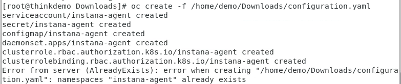

<AnchorLinks>
  <AnchorLink>1-1: Login to the AIX LPAR</AnchorLink>
  <AnchorLink>1-2: Preparing to Install the Instana Agent</AnchorLink>
  <AnchorLink>1-3: Install the Instana Agnet on AIX</AnchorLink>
  <AnchorLink>1-4: Install the Instana Agent to Monitor OpenShift</AnchorLink>
  <AnchorLink>1-5: Summary</AnchorLink>
</AnchorLinks>

## 1-1: Login to the AIX LPAR

In this portion of the lab, you will be installing the Instana Monitoring Agent on the AIX LPAR that you used in previous labs.   This LPAR includes an instance of MariaDB.  We will installing the Agent and going through some additional configuration steps.

Bring up a terminal window and log into your AIX LPAR.  You will need to be root when installing the Instana Agent.

Run the following command to switch to root:
```sh
sudo -i
```

***

## 1-2:  Preparing to Install the Instana Agent
On some platforms, the Instana Host Agent comes pre-packaged with a Java SDK.  But, on AIX java is not include in the installation package.  So, the first step is to install java on the AIX LPAR.  Instana supports multiple vendor SDKs, but does require java 8 or 11.

Download a valid java version from https://ibm.box.com/shared/static/69j0oiqmnvyljahgfw49l7eu600c1v69.tar

Once java has been downloaded, use scp to copy the tar file to the AIX LPAR.
```sh
scp java8_AIX64.tar root@<IP address of AIX LPAR>:/tmp
```

Next, change directory to /opt
```sh
cd /opt
```

Extract the tar file:
```sh
tar -xf /tmp/java8_AIX64.tar
```

Type "ls -all" and confirm that you see a java8 directory.

Next, we must make sure that the java 8 JDK is in our PATH and that JAVA_HOME is set properly so that the Instana Agent uses the proper version of java.  There are multiple ways to achieve this.  For example, you can edit the Instana startup files or the setenv file.  For this lab, we are going to edit root's .profile

As the root user, type "cd" to change to root's home directory.
```sh
cd
```

Next, type "vi .profile":
```sh
vi .profile
```

Within vi, add the following content to the .profile file.
```sh
export JAVA_HOME=/opt/java8/jre
export PATH=$JAVA_HOME/bin:$PATH
```

Type ":wq" to save your changes and exit the vi session.
```sh
:wq
```

Finally, you must source the .profile file in order to set those environment variables in your current shell.  Type the following:
```
. ./.profile
```

To confirm that the environment variables are set correctly, type the following:
```sh
echo $JAVA_HOME
echo $PATH
```

Confirm that you see **/opt/java8/jre** in both the **JAVA_HOME** and **PATH** environment variables.

***

## 1-3:  Install the Instana Agent on AIX
Next, we'll be installing the Instana Agent on the AIX LPAR.

Leave the terminal window open.  We'll be using it later.

For now, login to the Instana user interface at:  https://instana-labs.instana.io/
Login as apmdemo-2@yahoo.com with the password provided by the lab instructor.

Select the "Stan" the robot icon in the upper left corner
  

Next, click the **"Deploy Agent"** button near the upper right corner.
  

A window will open with a list of different environments where you can install the Instana Agent.  In this section of the lab, we are installing the AIX Host Agent.  Select **Unix** from the list of OS's.

Next select the dropdown list in the middle of the page.  Select "**AIX (64bit - PowerPC)**" and then click the **Download** button to download the Host Agent.
  

You'll notice that there are multiple options for AIX.  In this environment, we are using a 64-bit version of AIX.  In addition, there is an option for a "**static**" Agent.  Static Agents are used when you are in an air-gapped environment or when there are strict change control processes.  The **dynamic** agents are recommended for most environments.  The sensors for the discovered technologies will automatically download as needed and the Agent and sensors will automatically update themselves as new fixes and enhancements become available.  This lowers your total cost of ownership.

The reason that you downloaded the Host Agent from the Instana user interface is that the media has specifically been configured so that the Agent will communicate and send data to your Instana server.  This includes the path to the Instana server as well as the Agent Key necessary to communicate with your backend server.

Now that you have download the Agent tar file, you must copy it to the AIX LPAR.   Use **scp** to copy the image to the LPAR.

```sh
scp instana-agent-aix-ppc-64bit.tar.gz root@<IP address of AIX LPAR>:/tmp
```
Replace \<IP address of AIX LPAR\> with the IP address of the AIX LPAR.
 
cd to the /opt directory.
```sh
cd /opt
```

Now, extract the tar file by typing:
```sh
tar -xf /tmp/instana-agent-aix-ppc-64bit.tar.gz
```

Now, you must start the Agent.  In a production environment, you would also want to setup the /etc/rc.d autostart files, but we are going to skip that step for the lab. 

Now, let's start the Instana Agent.  Change directory to the /opt/instana-agent/bin directory
```sh
cd /opt/instana-agent/bin
```

Run the start command by typing:
```sh
./start
```

This will start the Instana Agent.

In addition, there are some optional configuration steps.  We'll examine and change some of the optional configuration parameters.

Change directory to /opt/instana-agent/etc/instana
```sh
cd /opt/instana-agent/etc/instana
```

This is the primary directory where most configuration changes are made.   However, there are some configuration files in the parent directory.  For example, if you setup your own internal maven repository to host the sensors, that configuration would be specified in the /opt/instana-agent/etc/mvn-settings.xml file.

Use **vi** to edit the configuration.yaml file.
```sh
vi configuration.yaml
```

This is the main configuration file that contains mandatory and optional configuration parameters for the Host Agent and the application/middleware sensors.  We'll be modifying a few key settings so that you can understand some of the possibilities.

One important aspect of Instana's configuration.yaml file is that it is read from dynamically by the Agent.  As you save changes to the file, those changes are immediately detected and implemented by the Agent.  There is no need to recycle the Agent in order for the changes to take effect.  This is not true for all of the configuration files.  For example, if you customize the mvn-settings.xml file, you must restart the Agent for the changes to take effect.

As you scroll down through the file, you'll see a section titled **"Secret manager integration"**.  You'll notice that some of the sensors will require a password.  By specifying a secret manager such as Hashicorp, you can store the passwords in the vault instead of specifying them in an ASCII file.   We won't be using that for this lab.

Scroll down further until you see the **Host** section.   Within the **Host** section, you'll notice a few important options. To customize the parameters, you must uncomment the lines by removing the **#** symbol.  Also, keep in mind that this is a yaml file and formatting is very picky.   Lines must be indented by 2 spaces at a time.  Within the host section, you'll see that there is a section where you can specify **tags**.  Tags can be very useful in helping you manage large scale environments.   You'll also notice a parameter called **aixEventsPollRate**.  This parameter allows you to get Events from the AIX Error Report log into Instana.   Let's add some tags to this Agent.  Uncomment the section and add an application name tag of **wordpress** and add a **production** tag.   After you have finished editing, the section should look like this:  
```sh
# Host
# other comments
com.instana.plugin.host:
  tags:
    - 'production'
    - 'wordpress'
#  filesystems
```

In the next section, you will see **Hardware & Zone**.  Let's edit this section and add a Zone name.  Zones are used to organize the Agents within the Infrastructure view in the UI, but can also be used to filter data for custom dashboards and threshold assignments.

Uncomment the section and change the **availability-zone** to something meaningful like your name so that you can find it in the UI.  The section should look something like this: 
```sh
# Hardware & Zone
com.instana.plugin.generic.hardware:
  enabled: true # disabled by default
  availability-zone: 'BenS'
```

Continue to scroll down until you find the **Custom processes** section.  By default, Instana monitors key processes that are related to the technologies that are discovered such as java processes, databases, etc.  It also gathers information on any process that is consuming a lot of CPU or Memory.  But, sometimes there is a desire to monitor other specific processes.  This section allows you to do that by specifying process names, service names, or arguments.  Let's configure instana to monitor the crond process.  Edit the section so that it looks as follows:
```sh
com.instana.plugin.process:
  processes:
    - 'cron'
```

By monitoring the **cron** process, we can see its performance utilization and can also monitor to ensure that the process is running.

Finally, scroll down to the section titled **"MariaDB"**.  Since this server is running MariaDB, let's configure that sensor.  Uncomment the section and specify the MariaDB credentials as follows. Replace \<mariadb username\> and \<mariadb passwd\> with the username and password for your environment.
```sh
# MariaDB
com.instana.plugin.mariadb:
  user: '<mariadb username>'
  password: '<mariadb passwd>'
```

Finally, save the changes to the configuration.yaml file by typing **":wq"** within the **vi** session.
```sh
:wq
```

The Agent is now running and has been configured with the following optional configurations:
- Zone name has been specified
- **production** and **wordpress** tags have been set.
- The Agent is monitoring the cron process
- The MariaDB sensor has been configured

Open the Instana UI and select the Infrastructure view
  

You should see your AIX Host Agent show up within the zone name that you specified.   Sometimes it take a few minutes before the Agent moves from the **undefined** zone to the zone name that you specified.


***

## 1-4:  Install the Instana Agent to Monitor OpenShift
In this lab, we will be installing the Instana Agent into an OpenShift on Power cluster.  You will be using the same cluster that you used in previous labs during the Tech Academy.

**Leave the Terminal window open**, but select the browser and navigate to the tab containing the Instana user interface.   

Select the "Stan" the robot icon in the upper left corner
  

Next, click the **"Deploy Agent"** button near the upper right corner.
  

A window will open with a list of different environments where you can install the Instana Agent.  In this lab, we are installing into OpenShift, so select OpenShift from the list.
  

Select the dropdown list next to the word **"Technology"**.  Notice that there are multiple options for installing the Agent.  Choose the **"YAML"** option from the list.
   


Enter a name for the Cluster and Zone as seen below.  Use **your name** for the **"Cluster name"** and **your name** for the **"Zone name"**.  This will allow you to find your Agent and Kubernetes Cluster within the user interface and not get confused by data coming in from other students.
   

Next, click the "Download" button to download the yaml file.  The yaml file has been configured specifically to connect to your Instana SaaS environment and will contain the **Cluster** name 
and **Zone** name that you previously specified.
   


If you downloaded the yaml file to your laptop, you must login to the OCP cluster before installing the Agent.  Once you are logged into the OCP Cluster, you can install the Agent using the **oc** command as shown below.

If you don't have the oc command on your laptop, you can scp the configuration.yaml file to the bastion node on the OCP cluster and issue the **oc** command from the bastion node.

Issue the following command in the directory that contains the configuration.yaml file:
```sh
oc create -f ./configuration.yaml
```
You will see output similar to what's shown below
  

This command will create an instana-agent project/namespace and install the Instana Agent as a daemonset within the cluster.  As a daemonset, it will run one Agent pod on each node in the cluster.  There are options to either monitor or omit the Master Nodes within the cluster and many other configuration options that can be found in the product documentation.

The installation process is nearly identical for other versions of kubernetes.


 Next, you need to setup the proper permissions for the service account.  This will allow the Agent to have access to monitor the entire cluster.

 First, change to the instana-agent OpenShift project by typing:
 ```sh
 oc project instana-agent
 ```

 Type the following command to setup the proper permissions.  Instana is attempting to monitor the entire cluster and needs access to all projects/namespaces.   
 ```sh
 oc adm policy add-scc-to-user privileged -z instana-agent
 ```

 You should see output similar to the screen capture below.
  

Next, type:  
```sh
oc get pods
```

This will provide a list of the pods that are in this namespace (project).  Notice that the instana-agent pod is running.
  

If the pod is not running, wait a minute and issue the "oc get pods" command again.

***

## 1-5: Summary

In this portion of the lab, you learned out to install the Instana Agent to monitor AIX and kubernetes/OpenShift.  You also learned some of the configuration options to customize the Agent and setup sensors that require customization. 

You should now have an AIX Agent that is installed and monitoring MariaDB and you should have an OpenShift cluster being monitored.


To continue other portions of the lab, select one of the lab exercises in the upper left corner or select one of the images below.


<Row>

<Column colLg={4} colMd={4} noGutterMdLeft>
<ArticleCard
    color="dark"
    subTitle="Explorer Instana"
    title="Explore the Instana UI and Capabilities"
    href="/tutorials/Explore"
    actionIcon="arrowRight"
    >


</ArticleCard>
</Column>

<Column colLg={4} colMd={4} noGutterMdLeft>
<ArticleCard
    color="dark"
    subTitle="Diagnose a Problem"
    title="Learn How Instana Can Help you Quickly Diagnose a Complex Problem"
    href="/tutorials/Diagnose"
    actionIcon="arrowRight"
    >


</ArticleCard>
</Column>

<Column colLg={4} colMd={4} noGutterMdLeft>
<ArticleCard
    color="dark"
    subTitle="Administer Instana"
    title="Learn How to Perform Administrative Tasks in Instana"
    href="/tutorials/Administration"
    actionIcon="arrowRight"
    >


</ArticleCard>
</Column>
</Row>


***