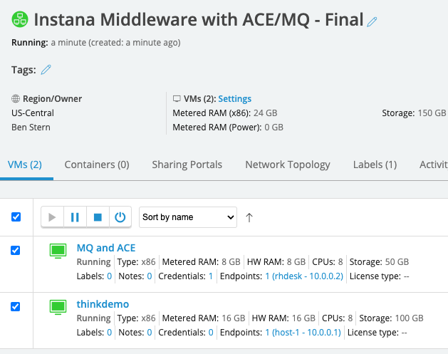
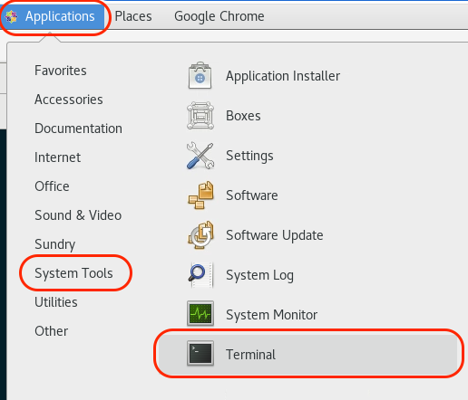
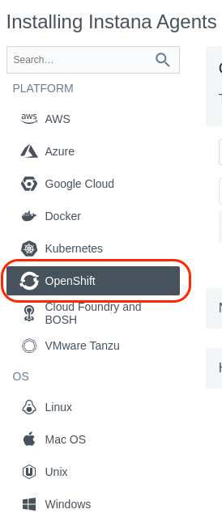
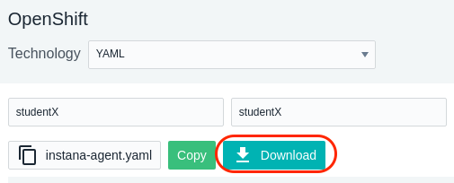
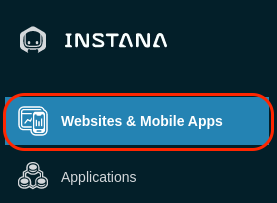
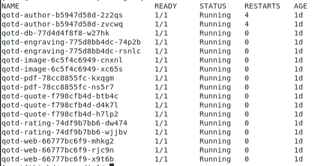
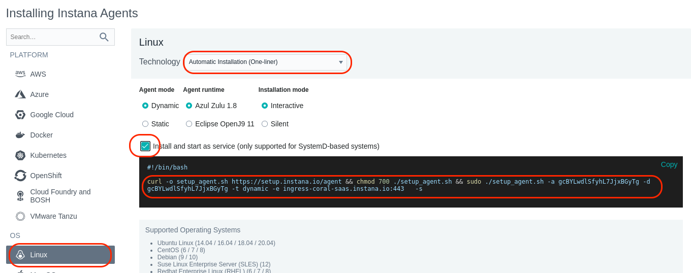
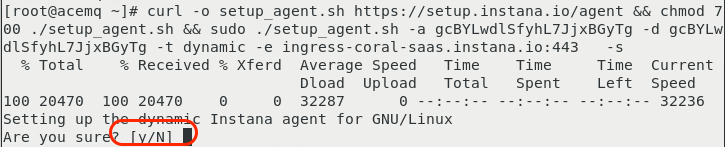
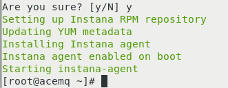

<AnchorLinks>
  <AnchorLink>1-1: Login to the Virtual Machine</AnchorLink>
  <AnchorLink>1-2: Preparing to Install the Instana Agent</AnchorLink>
  <AnchorLink>1-3: Install the Instana Agent to Monitor OpenShift</AnchorLink>
  <AnchorLink>1-4: Preparing to Install the Quote of the Day Application</AnchorLink>  
  <AnchorLink>1-5: Perform the helm install of Quote of the Day</AnchorLink>
  <AnchorLink>1-6: Configure Quote of the Day to use and external ACE and MQ server</AnchorLink>
  <AnchorLink>1-7: Install the Instana Linux Agent on the ACE/MQ Server</AnchorLink>
  <AnchorLink>1-8: Configure ACE and MQ for Resource Monitoring</AnchorLink>
  <AnchorLink>1-9: Configure ACE and MQ for Tracing</AnchorLink>
  <AnchorLink>1-10: Configure the ACE and MQ Sensors</AnchorLink>
  <AnchorLink>1-11: Summary</AnchorLink>
</AnchorLinks>

## 1-1: Login to the Virtual Machine

In this portion of the lab, you will be installing the Instana Monitoring, installing the "Quote of the Day" hybrid application, and configuring the Instana to monitor the application.

At this point, you should be logged into Soleil and should see the two virtual machines.


If you haven't already done it, click on the **"thinkdemo"** VM

Click on the window and you will see a login dialog.  Login as demo with a password of **"Passw0rd"**

After logging in, you will see that chrome has already been opened with 3 tabs at the top.  The first tab is the lab guide.  The 2nd tab is the Instana user interface,
and the 3rd tab is a list of user accounts.  From this point forward, we recommend you use the lab guide within the virtual machine unless you have 2 monitors.

Open the 3rd tab and review the user accounts.  You'll notice 3 columns.  The first column is the student name.  This matches the student name that you were assigned. 
Next to the Student Name, you will see an "Instana Login" column.  This column represents the username that you will use to login to the Instana user interface.  Find
the username associated with your "Student Name".  Finally, you will see a password column.
 


Click on the 2nd tab in the browser to open the Instana user interface.  In some cases, you will already be logged in.  In other cases, you'll see a login dialog.
   


If you are not already logged in, enter the "Instana Login" name associated with **your student name** and enter the password that you found on the 3rd tab. Finally, click the Login button.

You will see the summary page for Instana.  We'll come back to the user interface later.  

**Leave the browser open**. You'll be using it later.

Next, open a Terminal window within the virtual machine.  To do this, select **"Applications"** in the upper left corner.  Then, flyover **"System Tools"**. Finally, select **"Terminal"**
 

A terminal window will open.  Select the terminal window.


## 1-2:  Preparing to Install the Instana Agent
Next, we'll be installing the Instana Agent.  

To make things easier, we'll switch to the root user account using "sudo"


Type the follwing command:
```sh
sudo -i
```

When prompted, enter "**Passw0rd**" for the password.

Due to the cloning process, the yum repository might get corrupted.  To fix the yum repository, run the following command:
```sh
subscription-manager clean
```

Throughout these procedures, we are going to be using your student name for various naming conventions and to identify objects.  In order to simplify the steps in this document, 
you are going to setup an environment variable named $STUDENT and set it to the student name that you were assigned (student1 through student30) 

Type the following command, but replace **studentXXX** with your student name.  Make sure the first STUDENT is in upper case.  This is an environment variable.   The actual student name is typically lower case.

The command should look something like this:   **export STUDENT=student27**
```sh
export STUDENT=studentXXX
```

Test to make sure the variable was set properly.  Type:
```sh
echo $STUDENT
```
The output should be something like "student27".


Throughout this lab, we will be using the "oc" command to run commands within OpenShift.  The "oc" command is similar to kubectl for other versions of kubernetes.  There are
some minor syntax differences.

You are now ready to install the Agent.   


## 1-3:  Install the Instana Agent to Monitor OpenShift
**Leave the Terminal window open**, but select the browser and navigate to the tab containing the Instana user interface.   

Select the "Stan" the robot icon in the upper left corner
  

Next, click the **"Deploy Agent"** button near the upper right corner.
  

A window will open with a list of different environments where you can install the Instana Agent.  In this lab, we are installing into OpenShift, so select OpenShift from the list.
  

Select the dropdown list next to the word **"Technology"**.  Notice that there are multiple options for installing the Agent.  Choose the **"YAML"** option from the list.
   


Enter a name for the Cluster and Zone as seen below.  Use **your student name** for the **"Cluster name"** and **your student name** for the **"Zone name"**.  This will allow you to find
your Agent and Kubernetes Cluster within the user interface and not get confused by data coming in from other students.
   

Next, click the "Download" button to download the yaml file.  The yaml file has been configured specifically to connect to your Instana SaaS environment and will contain the **Cluster** name 
and **Zone** name that you previously specified.
   

You can now install the downloaded yaml file into the environment. This will install the Instana Agent as a daemonset within the OpenShift cluster.  The process is nearly
identical for other versions of kubernetes.

To install the Agent using the yaml file, type:  
```sh
oc create -f /home/demo/Downloads/configuration.yaml
```

You will see output similar to what's shown below
  

 Next, you need to setup the proper permissions for the service account.  This will allow the Agent to have access to monitor the entire cluster.

 First, change to the instana-agent OpenShift project by typing:
 ```sh
 oc project instana-agent
 ```

 Type the following command to setup the proper permissions:   
 ```sh
 oc adm policy add-scc-to-user privileged -z instana-agent
 ```

 You should see output similar to the screen capture below.
  

Next, type:  
```sh
oc get pods
```

This will provide a list of the pods that are in this namespace (project).  Notice that the instana-agent pod is running.
  

If the pod is not running, wait a minute and issue the "oc get pods" command again.


## 1-4:  Preparing to Install the Quote of the Day Application
Next, you'll be installing the **"Quote of the Day"** application.   For the containerized portion of the application, some technologies will automatically be instrumented
for monitoring.  In some cases, minor configuration changes are necessary. For this node.js based application, there are minor configuration changes that you will enable 
during the install.

For more information about the **Quote of the Day** application, you can go to this GitLab location:  https://gitlab.com/quote-of-the-day/quote-of-the-day
It is not necessary to go to this GitLab location, but you might be interested in learning more about the application.

The first thing you need to do is to create project (namespace) for the application and the load generation tool.   Then, you need to setup the OpenShift permissions
for those projects.  Run the following commands to setup the namespaces and permissions.

Issue the following 4 commands:
```sh
oc new-project $STUDENT-load
oc adm policy add-scc-to-user anyuid -z default
oc new-project $STUDENT
oc adm policy add-scc-to-user anyuid -z default
```

## 1-5:  Perform the helm install of Quote of the Day

The helm repository where we will be installing the application has already been setup on your virtual machine.  But, let's update the helm repo to ensure we get the current code.
Issue the following command:
```sh
helm repo update
```

You should see output indicating that it successfully got an update to the "qotd" chart repository.
  


Next, you need to define a Website within the Instana user interface.  Leave the terminal window open and return to the brower.  Open the browser tab containing the Instana UI.  Then, click on the **"Websites & Mobile Apps"** icon hear the upper left corner.
  

You will see a list of previously defined Websites.   You are going to create a new Website by clicking on the **"+ Add Website"** link near the upper right corner.
  


A dialog will open asking for a Website Name.  Enter **your student name** as the Website Name and click **"Add Website"** as seen below.
  


A dialog will open with some javascript.  For an traditional web application, you could add this javascript to the HTML pages.  But, in this case, you will use the 
information when you deploy the Quote of the Day application.
  

As seen in the dialog, copy the value associated with the "key".  It is highlighted with a red oval.  Do not include the single quotes when you copy the text.  You'll use the key when performing the helm install of the application.  This will allow the application to send End User Experience (EUM) data to the Instana server.

The helm command that you are going to use is in a file /media/qotd.  You are going to use "sed" to replace the application key that is in that file with the key
that you just extracted from the Instana UI.   Type the following command.  When you type the command, replace **KEY_VALUE** with the key value that you extracted.  

Note:  If you prefer, you can edit **"/media/qotd.sh"** and replace the key value of deOQ5O_8Tz27r820NpQnlg with the key value for your website. 

```sh
sed -i 's/deOQ5O_8Tz27r820NpQnlg/KEY_VALUE/g' /media/qotd.sh
```

Again, we'll be using the $STUDENT environment variable to ensure that the command is unique for your student name.  Let's double check to make sure the variable 
is still set.  Type:
```sh
echo $STUDENT
```

If it is not set to your student name, type the following command and replace studentXXX with your student name.
```sh
export STUDENT=studentXXX
```

You will be executing the /media/qotd.sh script to execute the helm install. Let's confirm that the **/media/qotd.sh** file got updated correctly.  Use the **"cat"** to see the file contents.
```sh
cat /media/qotd.sh
```
The results should look something like this:
```sh
helm install $STUDENT qotd/qotd --set host=apps.console.thinkdemo.tivlab.raleigh.ibm.com --set instanaReportingUrl=https://eum.coral-saas.instana.io --set instanaEnumMinJsUrl=https://eum.instana.io/eum.min.js --set instanaKey=6lTmRDdDTVuna-ZLFAyC5w --set enableInstana=true --set appNamespace=$STUDENT --set loadNamespace=$STUDENT-load --set useNodePort=true --set branding="$STUDENT"
```
In particular, pay attention to whether the **"instanaKey"** was replaced with the key from the website that you define within the Instana UI.

Now,  run the helm install by executing the shell script.  Type:
```sh
/media/qotd.sh
```

You will see output similar to this:
  

At this point, the application should be running.  In addition, the load generation tool is continuously running transactions against the application.  Let's verify that things are 
running.

Type the following command to see the pods:  
```sh
oc get pods -n $STUDENT
```

You should see results similar to what's shown below.

  


If the pods are not running, wait a minute and try the **"oc get pods"** command again.

If you notice that the qotd-db pod is in ERROR or CrashLoopBackOff state, run the following commands:
```sh
oc project $STUDENT
oc adm policy add-scc-to-user anyuid -z default
```

Next, verify that the automated workload is running.  Type the following command:
```sh
oc get pods -n $STUDENT-load
```

You should see results similar to what's shown below.
  

If the pods are not running, wait a minute and try the "oc get pods" command again.


## 1-6:  Configure Quote of the Day to use and external ACE and MQ server

The next step is to modify the configuration of the Quote of the Day application so that it uses an external ACE and MQ server.  By default, the application
simulates the ACE/MQ workload.

You will do this by editing the deployment for the qotd-engraving.  

Type the following command:  
```sh
oc edit deployment qotd-engraving -n $STUDENT
```
This will open a "vi" session.  Scroll down within the file to line 49.  You should see 3 lines of text like the following:
```sh
        - name: SUPPLY_CHAIN_URL
        - name: SUPPLY_CHAIN_SIMULATE
          value: "true"
```

When using **"vi"** to edit files, type the letter "i" to ensure insert mode.  After inserting text, press the escape key **"ESC"** to exit insert mode.  You can type the letter "x" to delete single characters.

You will modify those lines to look like the following.  You need to add a "value" parameter that contains the SUPPLY_CHAIN_URL for the ACE flow. The flow within the
ACE server is **"http://10.0.0.3:7081/supplychain/v1/order"**.  This is what you need to use for the SUPPLY_CHAIN_URL value.  You'll need to change the value for the SUPPLY_CHAIN_SIMULATE to "false" to disable the simulation.  When you are done, the lines should look like this:
```sh
        - name: SUPPLY_CHAIN_URL
          value: http://10.0.0.3:7081/supplychain/v1/order
        - name: SUPPLY_CHAIN_SIMULATE
          value: "false"
```

Type **":wq"** to save your changes and exit the file. 
```sh
:wq
```

As soon as you save your changes, OpenShift will automatically redeploy the **"qotd-engraving"** pod with the updated configuration.

## 1-7:  Install the Instana Linux Agent on the ACE/MQ Server

The next step is to go to the other virtual machine in Soleil. 

The easiest way to switch virtual machines is to move your mouse to the top of the page.  Select the icon in the upper left corner that looks like a picture of two overlapping computer monitors.
  

Then, select the **"MQ and ACE"** virtual machine.

At the login prompt, login with a password of **"Passw0rd"**.

In the lab guide, click on the link for section **"1-7"** to continue the lab exercises.

Open a Terminal window within the virtual machine.  To do this, select **"Applications"** in the upper left corner.  Then, flyover **"System Tools"**. Finally, select **"Terminal"**
 

A terminal window will open.  

Click on the terminal window.

Use sudo to become the root user.  Type the following command:
```sh
sudo -i
```
When prompted, enter **"Passw0rd"** for the password.

Due to the cloning process, the yum repository might get corrupted.  To fix the yum repository, run the following command:
```sh
subscription-manager clean
```

Leave the terminal window open because you'll be coming back to the screen later.

Within the Virtual Machines, select the **"Instana"** tab within the browser to open the Instana user interface.   Login using the username and password assigned to you.  If you don't remember,
the 3rd tab in the browser contains a list of user accounts.
  

Select the **"Stan"** the robot icon in the upper left corner
  

Next, click the **"Deploy Agent"** button near the upper right corner.
  

A window will open with a list of different environments where you can install the Instana Agent.  This is a Linux server, so select Linux on the left side of the screen.
  

Just to see what your options are, select the **"Technology"** dropdown list to see the different ways that you can install the Instana Agent.  You'll notice that you can perform
rpm installs or simply download a tar file.  But, the easiest method is the default one, **"Automatic Installation (One-Liner)"**.  Select that option in the dropdown list.

Notice that there are a few other options including the use of different java versions, static vs. dynamic agents, etc.   Leave the default settings.

Next, select the checkbox next to **"Install and start as service"**.  This will setup the systemctl autostart process and will also start the Agent immediately after it is installed.

Finally, copy and paste the curl command by selecting in with your mouse and then doing a **right-click** and selecting **"Copy"**.
  


Next, within the terminal window, **right-click** and select **"Paste"**.  This will paste the install command into the terminal window.

Press **"Enter"** to begin the install.

You will be promted with **"[y/N]"** asking whether you want to continue the install.   

  

Type lower case **"y"** and then press **"Enter"** to continue the install.

The install will progress and you will see an output similar to the screen capture shown below.

  

At this point the Agent is installed and up and running.

The Agent will automatically start monitoring the operating system and start discovering key processes and middleware.  In many cases it will automatically instrument
those technologies.  In the case of MQ an and App Connect Enterprise(ACE), there are manual configuration steps required due to the need to provide credentials for accessing those applications.  We'll walk through those configuration steps in a little while.


## 1-8:  Configure ACE and MQ for Resource Monitoring
This section of the lab is **optional**, but you might find it useful.  It will help you understand how IBM MQ and IBM App Connect Enterprise (ACE) need to be configured for monitoring.  There are certain configuration settings within MQ and ACE that are required in order to get the
monitoring KPIs.  The key KPI's that need to be enabled are Resource Stats and Flow Stats.  The requirements are documented in the **sensor configuration guide** that is online.  You'll see links to those guides further down in this document.  

Note:  Typically, these steps are performed by the MQ and ACE admins, so you don't need to know the step by step procedure.

In your lab environment, these steps have already been performed.

The "Resource Monitoring" KPIs are already enabled in most customer environments.   But it is worth validating the configuration.  For example, you can use the
ACE mqsireportresourcestats and mqsireportflowstats commands to view the configuration for ACE.  

Here are example commands that you can issue to see the ACE configuration:
```sh
mqsireportresourcestats BK1 -e EG2
```

You will see results similar to those shown below.  Notice that the "state" is set to "true" indicating that **"Resource Stats"** are enabled.
  

To see the configuration of the "flow" stats, issue the following command:
```sh
mqsireportflowstats BK1 -s -e EG2
```

You will see results similar to those shown below.  Notice that the "state" is "active", and the outputFormat is "json".  This indicates that the **"Flow Stats"** are enabled.  The product
requires that the output format be set to json vs. XML.
  

There are fewer requirements for MQ.  The sensor will work with the default settings.  However, you can have the sensor automatically use thresholds/Events that are 
setup within the MQ server.  If you want to use the built in MQ Events, then you need to set **CHLEV** (Channel Events) and **PERFMEV** (Performance Events) to **ENABLED**.  To check those settings, you can issue The
following commands.  You first need to run the **"runmqsc"** command.  The **runmqsc** command won't prompt you with a cursor.  That's okay.  Just start typing the coomands.

Within the runmqsc command prompt you can issue other MQ commands.  Type the following commands.
```sh 
runmqsc QM1
```
Then:
```sh
display QMGR PUBSUB CHLEV
```
```sh
display QMGR CLUSTER PERFMEV
```

Type **"quit"** to exit the runmqsc command prompt.
```sh
quit
```

These commands will give outputs similar to what's shown below.

  

In the output, you can see that the CHLEV (Channel Events) is enabled.  You can see that PERFMEV (Performance Events) is set to enabled.

## 1-9:  Configure ACE and MQ for Tracing

In addition to the "Resource Monitoring" KPIs, additional settings are required to enable Tracing within IBM MQ and ACE.  It is important that you understand this 
process since Tracing is typically not enabled by default in most IBM MQ and ACE environments.  In this section, we've documented the steps.

Note:  Typically, these steps are performed by the MQ and ACE admins, so you don't need to know the step by step procedure.

This section is simply going to describe the process.  You do not need to perform these steps.  The procedure is well documented within the Instana online documentation.

For ACE, you perform the following steps
- Download a small TAR file from IBM Fix Central.  There are links within the Instana documentation. 
- Extract the tar file into the **/var/mqsi/shared-classes** directory
- Stop the ACE server
- Run the following command to "Install" the **User Exit**:  **mqsichangeflowuserexits BK1 -o -x /var/mqsi/shared-classes**
- Start the ACE server
- Activate the **User Exit** by typing:  **mqsichangeflowuserexits BK1 -o -a ACEOpenTracingUserExit**

The MQ procedure is similar.  
- Download a small TAR file from IBM Fix Central.  There are links within the Instana documentation. 
- Extract the tar file to **/var/mqm/exits64**
- Edit the **/var/mqm/mqs.ini** file
- Add a small section within the **/var/mqm/mqs.ini** file.  The content can be copied and pasted from the Instana documentation.
- Restart the Queue Manager

In the lab environment, these steps have already been performed.  If you want, you can examine the files and directories specified above.

Note:  Even though the TAR files for ACE and MQ look similar, they are unique for each middleware component.

## 1-10:  Configure the ACE and MQ Sensors

After installing an Instana Agent, one of the first things you want to do is set a Zone name.  This allows you to organize your Agents to make them easier to find.  The Zones can
also be used for custom queries, threshold distribution, and more.   In your case, we want to set the Zone name to your student name.

Change directory to /opt/instana/agent/etc/instana
```sh
cd /opt/instana/agent/etc/instana
```

This is the main configuration directory for the Instana Agent and sensors.  There are few configuration files in the parent directory, but most of the important ones are here.

The **com.instana.agent.main.sender.Backend.cfg** file contains information on where the Agent is going to send the monitoring data.

We are going to be editing the configuration.yaml file.   This file contains all of the configuration settings for the sensors.

Edit configuration.yaml using either "vi" 
```sh
vi configuration.yaml
```
or use the Linux "Text Editor".  Navigate to the "Text Editor" via Applications -> Accessories -> Text Editor.
  


**------------IMPORTANT------------**  
yaml files are very strict about indentation.  Each line within the file must be indented by 0, 2, 4, 6, etc. spaces.  Do not use tabs and do not indent by odd numbers
of characters.  Make sure that all of the characters line up vertically within the text.   If you see a line that is commented out and you need to uncomment it, just
remove the single "#" character.

First, let's change the Zone name within the file.   Scroll down until you see the section titled "Hardware & Zone".  Uncomment the 3 lines of text starting with 
com.instana.plugin.generic.hardware.   By default the "availability-zone" parameter is set to "Datacenter A /Rack 42".  Change the value to your student name.  Example:   **student27**

The section should now look like this:

  

Within the editor, scroll down to the section titled **"IBM ACE"**

You will need to uncomment the required entries and change the parameters to match the ACE/MQ configuration on this server.  If you read the description on each line,
you'll see that some parameters are optional.  In addition, ACE can be configured to either use built in MQTT or use a local MQ server.  The configuration varies 
based on whether you are using MQ or MQTT.  

For more information about about the ACE configuration, view the online documentation found here:  [link](https://www.ibm.com/docs/en/obi/current?topic=technologies-monitoring-app-connect-enterprise)

Edit the **IBM ACE** section of the file so that it looks like this. If you want, you can copy this text and replace the entire section.  Or, you can change the 
individual parameters.
```sh
# IBM ACE
com.instana.plugin.ace:
  enabled: true
  poll_rate: 20
  NodesOrServers: # Multiple Integration node instances or multiple standalone Integration Servers can be specified
    BK1:     # specify the Integration node/server name (required)
      restApiPort: '4414'        # ACE rest api port (required)
      mqport: '1414'             # Sets the port for remote administration IBM MQ channel port or the MQTT server port (required)
      queuemanagerName: 'QM1'     # Queue Manager name (required for IBM MQ)
      channel: 'SVR.SVRCONN'             # Remote administration channel (required for IBM MQ)
      mqUsername: 'mqm'         # MQ channel authentication's username if security enabled (optional for IBM MQ)
      mqPassword: 'Passw0rd'         # MQ channel authentication's password if security enabled (optional for IBM MQ)
```

Next, you will need to edit the MQ sensor settings.   Scroll further down in the file until you find the section titled "IBM MQ".  You will be editing this section of
the configuration to match the settings of the MQ server.  There are a number of mandatory and optional parameters.  For more information on the configuration settings,
see the online documentation: [link](https://www.ibm.com/docs/en/obi/current?topic=technologies-monitoring-mq) 

Edit the **IBM MQ** section of the file so that it looks like this. If you want, you can copy this text and replace the entire section.  Or, you can change the 
individual parameters.
```sh
# IBM MQ
com.instana.plugin.ibmmq:
  enabled: true
  poll_rate: 5
  queueManagers: # Multiple Queue Manager instances can be specified
    QM1:
      channel: 'SVR.SVRCONN' # Remote administration channel
      username: 'mqm'
      password: 'Passw0rd'
```

Save and exit the configuration.yaml file.   In "vi", type ":wq" to save and exit the file.

As soon as you save your changes to the file, Instana will detect those changes and will start to implement what you have configured.

At this point, we recommend that you navigate to the "Explore" section of the lab.  In the Explore section, we'll begin by confirming that the ACE and MQ 
monitoring are working propererly.  If they are not, come back to this section and double check your configuraion.yaml settings and check that there are no obvious
errors in the log file.

The main install log file is /opt/instana/agent/data/log/agent.log

That completes this section of the lab.

## 1-11: Summary

In this portion of the lab, you learned out to install the Instana Agent to monitor kubernetes/OpenShift.  You learned how to install the Linux Agent on a traditional server.  And, you learned how to configure the Instana sensor for IBM App Connect Enterprise (ACE) and IBM MQ.


To continue other portions of the lab, select one of the lab exercises in the upper left corner or select one of the images below.


<Row>

<Column colLg={4} colMd={4} noGutterMdLeft>
<ArticleCard
    color="dark"
    subTitle="Explorer Instana"
    title="Explore the Instana UI and Capabilities"
    href="/tutorials/Explore"
    actionIcon="arrowRight"
    >


</ArticleCard>
</Column>

<Column colLg={4} colMd={4} noGutterMdLeft>
<ArticleCard
    color="dark"
    subTitle="Diagnose a Problem"
    title="Learn How Instana Can Help you Quickly Diagnose a Complex Problem"
    href="/tutorials/Diagnose"
    actionIcon="arrowRight"
    >


</ArticleCard>
</Column>

<Column colLg={4} colMd={4} noGutterMdLeft>
<ArticleCard
    color="dark"
    subTitle="Administer Instana"
    title="Learn How to Perform Administrative Tasks in Instana"
    href="/tutorials/Administration"
    actionIcon="arrowRight"
    >


</ArticleCard>
</Column>
</Row>


***